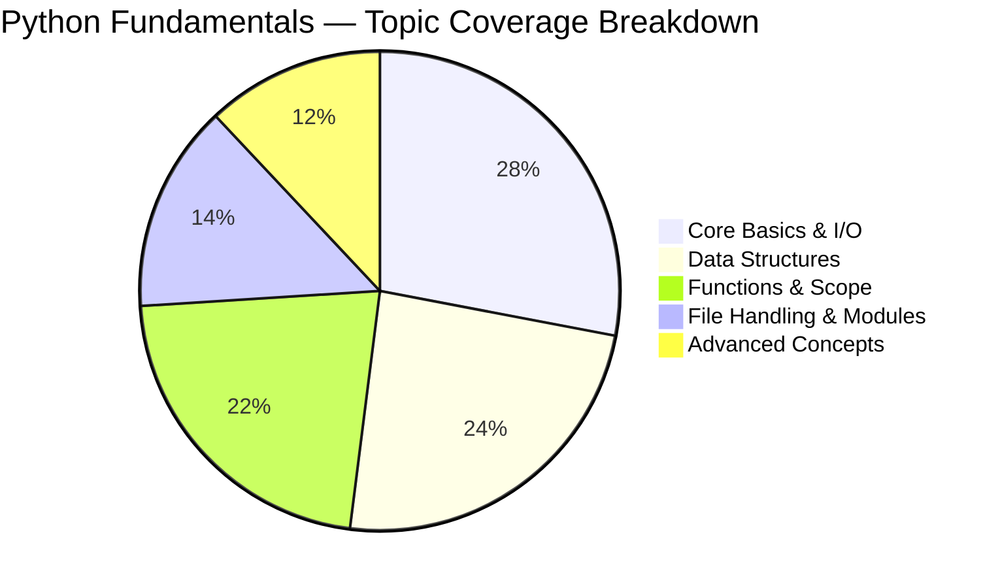
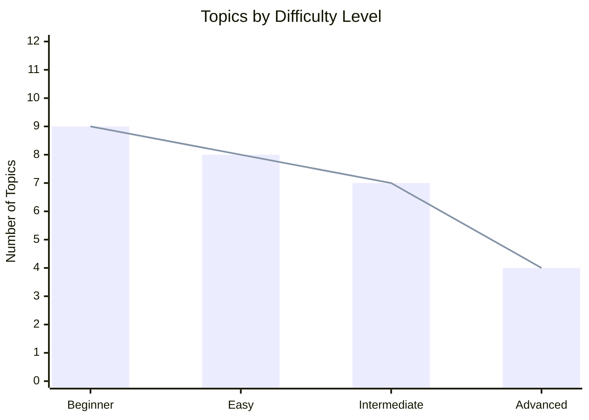
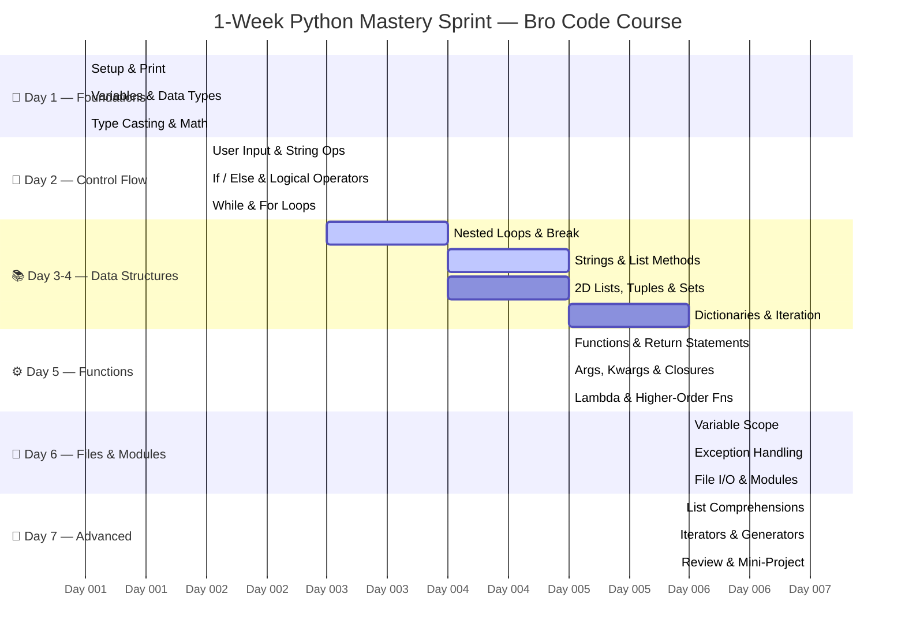
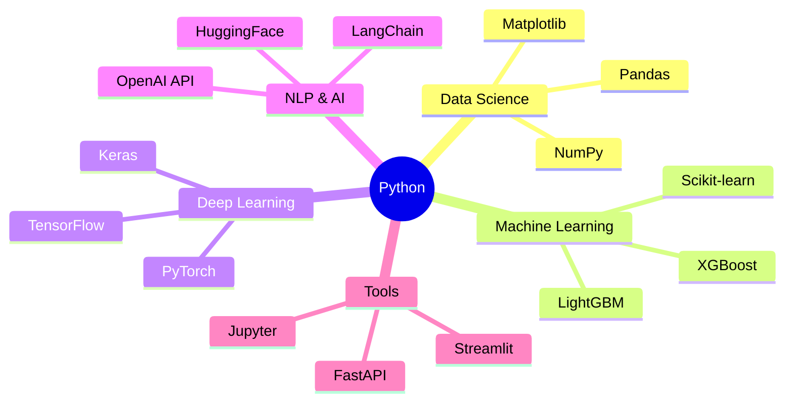

<div align="center">


<br/><br/>

[](https://python.org)
[](https://www.youtube.com/@BroCodez)
[](#)
[](https://github.com/MuhammadZafran33)

[](#)
[](https://github.com/MuhammadZafran33/Algorithm-Arsenal)
[](#)

<br/>

> *"The struggle is continuous — but so is the growth."* 💪

<br/>

</div>

---

## 🐍 About This Module

This folder is **Module 01** of the [Algorithm Arsenal](https://github.com/MuhammadZafran33/Algorithm-Arsenal) repository — a hands-on Python learning journey based on the legendary **Bro Code** Python full course on YouTube.

Every script here is **written from scratch**, **manually typed**, and **tested line by line** — no copy-pasting, no shortcuts. This is the raw foundation that powers every ML, DL, and AI project ahead.

| 🎯 Goal | 📅 Sprint | 🔥 Intensity | 🏆 Outcome |
|---------|-----------|-------------|------------|
| Master Python Fundamentals | 1-Week Target | High | Production-ready Python skills |

---

## 📊 Topic Distribution



---

## 📈 Difficulty Breakdown



---

## 🗺️ Learning Roadmap


---

## 📅 One-Week Sprint Timeline



---

## 📚 Complete Topics Reference

| # | 🏷️ Topic | 📂 File | 🎯 Core Concept | 🔥 Level | ✅ Status |
|---|-----------|--------|----------------|----------|----------|
| 01 | Print Function | `01_print.py` | Output to console | 🟢 Beginner | ✅ Done |
| 02 | Variables & Data Types | `02_variables.py` | `int`, `float`, `str`, `bool` | 🟢 Beginner | ✅ Done |
| 03 | Multiple Assignment | `03_multi_assign.py` | Assign multiple vars in one line | 🟢 Beginner | ✅ Done |
| 04 | Type Casting | `04_typecasting.py` | `int()`, `float()`, `str()` | 🟢 Beginner | ✅ Done |
| 05 | User Input | `05_input.py` | `input()` function | 🟢 Beginner | ✅ Done |
| 06 | Math Functions | `06_math.py` | `math` module, operators | 🟢 Beginner | ✅ Done |
| 07 | String Methods | `07_strings.py` | `.upper()`, `.replace()`, f-strings | 🟢 Beginner | ✅ Done |
| 08 | If / Else Statements | `08_if_else.py` | Branching & decision making | 🟢 Beginner | ✅ Done |
| 09 | Logical Operators | `09_operators.py` | `and`, `or`, `not` | 🟢 Beginner | ✅ Done |
| 10 | While Loops | `10_while_loops.py` | Iteration with condition | 🟡 Easy | ✅ Done |
| 11 | For Loops | `11_for_loops.py` | `range()`, iterating sequences | 🟡 Easy | ✅ Done |
| 12 | Nested Loops | `12_nested_loops.py` | Loops inside loops | 🟡 Easy | ✅ Done |
| 13 | Break & Continue | `13_break_continue.py` | Loop control statements | 🟡 Easy | ✅ Done |
| 14 | Lists | `14_lists.py` | Ordered, mutable sequences | 🟡 Easy | ✅ Done |
| 15 | 2D Lists | `15_2d_lists.py` | Matrices & nested lists | 🟡 Easy | ✅ Done |
| 16 | Tuples | `16_tuples.py` | Ordered, immutable sequences | 🟡 Easy | ✅ Done |
| 17 | Sets | `17_sets.py` | Unordered, unique collections | 🟡 Easy | ✅ Done |
| 18 | Dictionaries | `18_dicts.py` | Key-value pairs | 🟡 Easy | ✅ Done |
| 19 | Functions | `19_functions.py` | Reusable code blocks | 🟠 Intermediate | ✅ Done |
| 20 | Return Statements | `20_return.py` | Returning values from functions | 🟠 Intermediate | ✅ Done |
| 21 | Default Arguments | `21_default_args.py` | Parameter defaults | 🟠 Intermediate | ✅ Done |
| 22 | Keyword Arguments | `22_keyword_args.py` | Named function parameters | 🟠 Intermediate | ✅ Done |
| 23 | `*args` & `**kwargs` | `23_args_kwargs.py` | Variable-length arguments | 🟠 Intermediate | ✅ Done |
| 24 | Variable Scope | `24_scope.py` | Local, global, nonlocal | 🟠 Intermediate | ✅ Done |
| 25 | Exception Handling | `25_exceptions.py` | `try`, `except`, `finally` | 🟠 Intermediate | ✅ Done |
| 26 | File I/O | `26_file_io.py` | Read, write, append files | 🟠 Intermediate | ✅ Done |
| 27 | Modules & Imports | `27_modules.py` | Code reuse across files | 🟠 Intermediate | ✅ Done |
| 28 | Lambda Functions | `28_lambda.py` | Anonymous functions | 🔴 Advanced | ✅ Done |
| 29 | Higher-Order Functions | `29_higher_order.py` | `map()`, `filter()`, `reduce()` | 🔴 Advanced | ✅ Done |
| 30 | List Comprehensions | `30_comprehensions.py` | Pythonic one-liners | 🔴 Advanced | ✅ Done |

---

## 💡 Key Concepts — Code Snapshots

<details>
<summary>📦 <strong>Variables & Data Types</strong> — click to expand</summary>

```python
# ── Variables & Dynamic Typing ──────────────────────────────────
name    = "Muhammad Zafran"     # str
age     = 21                    # int
gpa     = 3.8                   # float
is_ai   = True                  # bool

# ── Type Casting ─────────────────────────────────────────────────
score   = int("99")             # "99"  →  99
pi      = float("3.14159")      # "3.14" → 3.14159
label   = str(42)               # 42     → "42"

# ── f-Strings (modern formatting) ────────────────────────────────
print(f"👋 Hi, I'm {name}! I'm {age} years old.")
# Output: 👋 Hi, I'm Muhammad Zafran! I'm 21 years old.
```

</details>

<details>
<summary>🔁 <strong>Loops & Control Flow</strong> — click to expand</summary>

```python
# ── While Loop ──────────────────────────────────────────────────
countdown = 5
while countdown > 0:
    print(f"🚀 T-minus {countdown}...")
    countdown -= 1
print("Liftoff! 🔥")

# ── For Loop with range() ────────────────────────────────────────
for i in range(1, 6):
    print(f"Step {i}: {'█' * i}")

# ── List Comprehension (Pythonic shortcut) ───────────────────────
squares  = [x**2  for x in range(10)]       # [0, 1, 4, 9 ... 81]
evens    = [x     for x in range(20) if x % 2 == 0]
```

</details>

<details>
<summary>📚 <strong>Data Structures</strong> — click to expand</summary>

```python
# ── List  →  ordered, mutable ────────────────────────────────────
skills = ["Python", "Machine Learning", "Deep Learning", "AI"]
skills.append("Computer Vision")
skills.sort()

# ── Tuple →  ordered, immutable ──────────────────────────────────
coordinates = (34.0151, 71.5249)            # Peshawar, KPK 🌍

# ── Set   →  unordered, unique ───────────────────────────────────
langs = {"Python", "SQL", "R", "Python"}    # "Python" stored once

# ── Dictionary  →  key-value pairs ──────────────────────────────
profile = {
    "name"       : "Muhammad Zafran",
    "field"      : "Artificial Intelligence",
    "university" : "IM|Sciences Peshawar",
    "semester"   : 4,
    "gpa"        : 3.8
}
print(f"🎓 {profile['name']} — Semester {profile['semester']}")

# ── 2D List  →  matrix / grid ────────────────────────────────────
matrix = [
    [1, 2, 3],
    [4, 5, 6],
    [7, 8, 9]
]
for row in matrix:
    print(" ".join(str(x) for x in row))
```

</details>

<details>
<summary>⚙️ <strong>Functions & Scope</strong> — click to expand</summary>

```python
# ── Basic Function ───────────────────────────────────────────────
def greet(name: str, msg: str = "Hello") -> str:
    return f"{msg}, {name}! 👋"

# ── *args & **kwargs ─────────────────────────────────────────────
def log_info(*args, **kwargs):
    for item in args:
        print(f"  → {item}")
    for key, val in kwargs.items():
        print(f"  {key}: {val}")

log_info("Muhammad", "Zafran", field="AI", uni="IM|Sciences")

# ── Lambda & Higher-Order Functions ─────────────────────────────
square   = lambda x: x ** 2
cube     = lambda x: x ** 3

nums     = [1, 2, 3, 4, 5, 6, 7, 8, 9, 10]
evens    = list(filter(lambda x: x % 2 == 0, nums))   # filter
doubled  = list(map(lambda x: x * 2, nums))            # map
```

</details>

<details>
<summary>🛡️ <strong>Exception Handling & File I/O</strong> — click to expand</summary>

```python
# ── Exception Handling ───────────────────────────────────────────
try:
    value = int(input("Enter a number: "))
    result = 100 / value
    print(f"✅ Result: {result:.2f}")
except ZeroDivisionError:
    print("❌ Cannot divide by zero!")
except ValueError:
    print("❌ Please enter a valid integer.")
except Exception as e:
    print(f"⚠️  Unexpected error: {e}")
finally:
    print("🏁 Execution complete.")

# ── File I/O ─────────────────────────────────────────────────────
# Write to file
with open("notes.txt", "w") as f:
    f.write("Python fundamentals — mastered! 🐍\n")

# Read from file
with open("notes.txt", "r") as f:
    content = f.read()
    print(content)
```

</details>

<details>
<summary>🧩 <strong>Advanced — Comprehensions & Lambda</strong> — click to expand</summary>

```python
# ── List Comprehension ───────────────────────────────────────────
squares     = [x**2 for x in range(1, 11)]
even_squares = [x**2 for x in range(1, 11) if x % 2 == 0]

# ── Dictionary Comprehension ─────────────────────────────────────
word_lengths = {word: len(word) for word in ["Python", "AI", "ML", "DL"]}
# {'Python': 6, 'AI': 2, 'ML': 2, 'DL': 2}

# ── Nested Comprehension (2D list/matrix flatten) ────────────────
matrix  = [[1,2,3],[4,5,6],[7,8,9]]
flat    = [val for row in matrix for val in row]
# [1, 2, 3, 4, 5, 6, 7, 8, 9]

# ── Generator Expression (memory efficient) ──────────────────────
total = sum(x**2 for x in range(1_000_000))  # No list built in RAM!
```

</details>

---

## 📉 Progress Tracker

```
Module Progress Overview
════════════════════════════════════════════════

🟢 Core Basics & I/O        ██████████████████████  100% ✅
🟡 Control Flow & Loops      ██████████████████████  100% ✅
🔵 Data Structures           ██████████████████████  100% ✅
🟠 Functions & Scope         ██████████████████████  100% ✅
📁 Files, Modules & Errors   ██████████████████████  100% ✅
🔴 Advanced Python           ██████████████████████  100% ✅

━━━━━━━━━━━━━━━━━━━━━━━━━━━━━━━━━━━━━━━━━━━━━━
🏆 Overall Completion        ██████████████████████  100% 🎉
━━━━━━━━━━━━━━━━━━━━━━━━━━━━━━━━━━━━━━━━━━━━━━
```

---

## 🗂️ Repository Architecture

This module sits at the heart of a growing **Algorithm Arsenal** — the complete dev journey from Python zero to AI researcher.

```
📦 Algorithm-Arsenal/
│
├── 🐍 Python By Bro Code/
│   ├── 📁 01-Python-Fundamentals/    ◄── YOU ARE HERE
│   ├── 📁 02-OOP/                    (coming soon)
│   └── 📁 03-Advanced-Python/        (coming soon)
│
├── 🤖 Machine Learning Projects/     (coming soon)
│   ├── 📁 Sentiment Analysis
│   ├── 📁 Health Prediction
│   └── 📁 Time Series Forecasting
│
├── 🧠 Deep Learning Projects/        (coming soon)
│   ├── 📁 CNN — Image Classification
│   ├── 📁 LSTM — Sequence Modeling
│   └── 📁 CNN-LSTM Hybrid
│
├── 🏢 Internship Projects/           (coming soon)
│   ├── 📁 Arch Technologies (Email Spam / MNIST CNN)
│   ├── 📁 Excelerate — Data Visualization
│   └── 📁 CS Technologies
│
└── 🔬 Research Projects/             (coming soon)
    └── 📁 KP-DengueAI Framework (PLOS ONE / Nature)
```

---

## ⚡ Quick Start

```bash
# 1. Clone the full repository
git clone https://github.com/MuhammadZafran33/Algorithm-Arsenal.git

# 2. Navigate to this module
cd "Algorithm-Arsenal/Python By Bro Code/01-Python-Fundamentals"

# 3. Confirm your Python version (3.10+ recommended)
python --version

# 4. Run any script — zero dependencies, pure Python!
python 02_variables.py
python 14_lists.py
python 30_comprehensions.py
```

> **No external packages needed** — every script in this folder runs on vanilla Python 🐍

---

## 🎓 Course Reference

| Resource | Description | Link |
|----------|-------------|------|
| 🎥 Bro Code Python Full Course | The course driving this folder | [Watch on YouTube ↗](https://www.youtube.com/@BroCodez) |
| 📘 Official Python Docs | The definitive reference | [docs.python.org ↗](https://docs.python.org/3/) |
| 📋 Python Cheatsheet | Quick syntax reference | [pythoncheatsheet.org ↗](https://www.pythoncheatsheet.org) |
| 🏋️ LeetCode | Practice problems (Easy tier first) | [leetcode.com ↗](https://leetcode.com) |
| 📊 Kaggle Learn | Free Python micro-course | [kaggle.com/learn ↗](https://www.kaggle.com/learn/python) |

---

## 🔑 Python in the Context of AI / ML

> Python is not just a language here — it's the **foundation** of everything.



---

## 🤝 Connect with Me

<div align="center">

[](https://www.linkedin.com/in/muhammad-zafran/)
[](https://github.com/MuhammadZafran33)
[](https://www.fiverr.com/muh_zafran)
[](https://imsciences.edu.pk)

<br/>

**Muhammad Zafran** — BS Artificial Intelligence, Semester IV  
Institute of Management Sciences (IM|Sciences), Peshawar, KPK 🇵🇰  
*AI Researcher · ML Engineer · Fiverr Freelancer*

</div>

---

<div align="center">

### ⭐ Star this repo if it helped you on your own journey!

*"Every expert was once a beginner. Every pro was once an amateur."*

<br/>

**Part of [Algorithm Arsenal](https://github.com/MuhammadZafran33/Algorithm-Arsenal)** — the complete tech journey of [Muhammad Zafran](https://github.com/MuhammadZafran33)

<br/>


</div>
