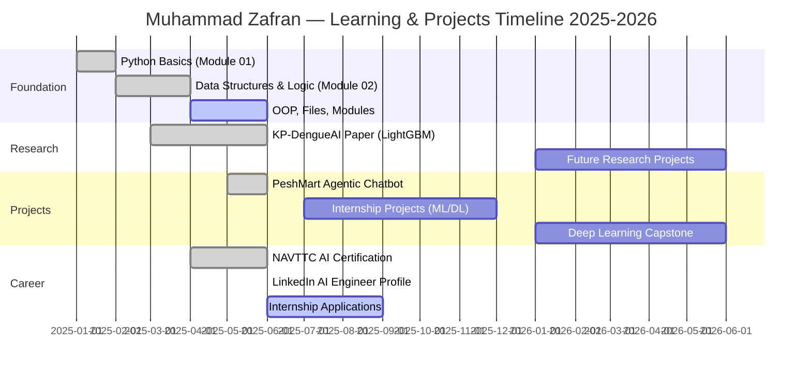

<div align="center">

<!-- HERO BANNER -->


<!-- BADGES -->
<p>
  
  
  
  
  
</p>

<p>
  
  
  
  
  
  
  
  
</p>

<br/>
</div>

> **🧠 "Data structures are the backbone of every algorithm. Master them once — wield them forever."**

<br/>

</div>

---

## 📋 Table of Contents

<div align="center">

| # | Section | Jump |
|:-:|:--------|:----:|
| 1 | 🗺️ Module Overview | [→](#-module-overview) |
| 2 | 🧭 Data Structures Mind Map | [→](#-data-structures-mind-map) |
| 3 | 📁 File Index | [→](#-file-index) |
| 4 | 🗂️ Lists | [→](#️-lists) |
| 5 | 📦 Tuples | [→](#-tuples) |
| 6 | 🔷 Sets | [→](#-sets) |
| 7 | 📖 Dictionaries | [→](#-dictionaries) |
| 8 | ⚡ Comprehensions | [→](#-comprehensions) |
| 9 | 🧪 Logic & Conditionals | [→](#-logic--conditionals) |
| 10 | 🔁 Loops | [→](#-loops) |
| 11 | ⚙️ Functions (Higher-Order) | [→](#️-higher-order-functions) |
| 12 | ⏱️ Big O Complexity Reference | [→](#️-big-o-complexity-reference) |
| 13 | 🛣️ Learning Roadmap | [→](#️-learning-roadmap) |
| 14 | 👤 Author | [→](#-author) |

</div>

---

## 🗺️ Module Overview

This module is **Section 02** of the *Python By Bro Code* learning path — the most critical foundation for any aspiring AI/ML Engineer. Every concept here feeds directly into data pipelines, model preprocessing, algorithm design, and interview preparation.

<div align="center">

```
┌─────────────────────────────────────────────────────────────┐
│          ALGORITHM ARSENAL  ·  Python By Bro Code           │
│                    Module 02 of XX                          │
├──────────────┬──────────────┬──────────────┬────────────────┤
│   01-Basics  │  02-DS&Logic │ 03-OOP (→)   │  04-Files (→)  │
│  Variables   │  ★ YOU ARE   │              │                │
│  I/O, Types  │   HERE ★     │              │                │
└──────────────┴──────────────┴──────────────┴────────────────┘
```

</div>

### What You'll Master

| Category | Skill | Real-World Use |
|:---------|:------|:--------------|
| 🗂️ **Lists** | Dynamic arrays, indexing, slicing, built-in methods | Feature arrays in ML, batch data |
| 📦 **Tuples** | Immutable sequences, packing/unpacking | Model outputs, coordinates, DB rows |
| 🔷 **Sets** | Unique collections, set algebra | Deduplication, category labels |
| 📖 **Dictionaries** | Hash maps, nested structures | JSON/API payloads, config objects |
| ⚡ **Comprehensions** | One-liner transformations | Data wrangling, feature engineering |
| 🧪 **Conditionals** | Boolean logic, branching | Decision trees, rule-based systems |
| 🔁 **Loops** | Iteration, recursion patterns | Dataset iteration, training loops |
| ⚙️ **Functions** | Lambda, map, filter, reduce | Functional data pipelines |

---

## 🧭 Data Structures Mind Map

```mermaid
mindmap
  root((Python DS &amp; Logic))
    Sequences
      List
        Mutable
        Ordered
        Duplicates Allowed
        Methods: append pop sort
      Tuple
        Immutable
        Ordered
        Packing & Unpacking
      String
        Slicing
        Methods: split join strip
    Collections
      Set
        Unordered
        No Duplicates
        Union Intersection Diff
      Dict
        Key-Value Pairs
        Hash Map Internally
        Nested Dicts
    Logic
      Boolean Operators
        and / or / not
      Comparison
        == != > < >= <=
      Conditionals
        if / elif / else
        Ternary Expression
    Iteration
      for loop
        range() iteration
        enumerate()
        zip()
      while loop
        break / continue
        Nested Loops
    Functional
      Comprehensions
        List Comp
        Dict Comp
        Set Comp
        Generator Expr
      Higher-Order
        lambda
        map()
        filter()
        reduce()
```

---

## 📁 File Index

<div align="center">

| # | File | Topic | Difficulty | Key Concepts |
|:-:|:-----|:------|:----------:|:-------------|
| 01 | `lists_basics.py` | 🗂️ Lists | 🟢 Beginner | Creation, indexing, slicing, `append`, `remove`, `pop` |
| 02 | `list_methods.py` | 🗂️ Lists | 🟢 Beginner | `sort`, `reverse`, `copy`, `count`, `index`, `extend` |
| 03 | `tuples.py` | 📦 Tuples | 🟢 Beginner | Immutability, packing, unpacking, nested tuples |
| 04 | `sets.py` | 🔷 Sets | 🟡 Intermediate | `union`, `intersection`, `difference`, `issubset` |
| 05 | `dictionaries.py` | 📖 Dictionaries | 🟡 Intermediate | CRUD ops, `.keys()`, `.values()`, `.items()`, `get()` |
| 06 | `nested_dicts.py` | 📖 Dictionaries | 🟡 Intermediate | Nested structures, iteration, `defaultdict` |
| 07 | `comprehensions.py` | ⚡ Comprehensions | 🟡 Intermediate | List, dict, set comprehensions, conditionals inside |
| 08 | `conditionals.py` | 🧪 Logic | 🟢 Beginner | `if/elif/else`, ternary operator, nested conditions |
| 09 | `loops_for.py` | 🔁 Loops | 🟢 Beginner | `for`, `range()`, `enumerate()`, `zip()` |
| 10 | `loops_while.py` | 🔁 Loops | 🟢 Beginner | `while`, `break`, `continue`, `pass` |
| 11 | `lambda_funcs.py` | ⚙️ Functions | 🔴 Advanced | `lambda`, `map()`, `filter()`, `reduce()` |
| 12 | `practice_exercises.py` | 🏋️ Exercises | 🟡 Intermediate | Mixed challenges, mini-projects |

</div>

> 📌 **Note:** Files follow the exact order of Bro Code's Python tutorial series. Work through them sequentially for the best learning experience.

---

## 🗂️ Lists

The most versatile and widely-used data structure in Python. Think of a list as a **dynamic array** that can hold anything.

```python
# ── Creation ────────────────────────────────────────────────
fruits  = ["apple", "banana", "cherry"]
mixed   = [1, "hello", 3.14, True, None]
nested  = [[1, 2], [3, 4], [5, 6]]

# ── Indexing & Slicing ──────────────────────────────────────
print(fruits[0])          # apple       → forward index
print(fruits[-1])         # cherry      → negative index
print(fruits[1:3])        # ['banana', 'cherry']
print(fruits[::-1])       # reversed list

# ── Common Methods ──────────────────────────────────────────
fruits.append("mango")    # add to end
fruits.insert(1, "kiwi")  # insert at index
fruits.remove("banana")   # remove by value
popped = fruits.pop()     # remove & return last
fruits.sort()             # in-place sort
fruits.sort(reverse=True) # descending sort

# ── ML Use-Case: Feature Vector ─────────────────────────────
features = [0.85, 1.2, 0.33, 2.7, 0.9]
normalized = [x / max(features) for x in features]
```

### List Methods Cheatsheet

| Method | Description | Time Complexity |
|:-------|:------------|:---------------:|
| `append(x)` | Add item to end | O(1) |
| `insert(i, x)` | Insert at position | O(n) |
| `remove(x)` | Remove first occurrence | O(n) |
| `pop(i=-1)` | Remove & return by index | O(1) / O(n) |
| `index(x)` | Find index of value | O(n) |
| `count(x)` | Count occurrences | O(n) |
| `sort()` | In-place sort (Timsort) | O(n log n) |
| `reverse()` | Reverse in-place | O(n) |
| `copy()` | Shallow copy | O(n) |
| `extend(iter)` | Add all items from iterable | O(k) |

---

## 📦 Tuples

Tuples are **immutable lists** — once created, they cannot change. This makes them faster, hashable, and safe for use as dictionary keys.

```python
# ── Creation ────────────────────────────────────────────────
point      = (3.5, 7.2)           # 2D coordinate
rgb        = (255, 128, 0)        # color value
singleton  = (42,)                # single-element tuple (note the comma!)

# ── Unpacking ───────────────────────────────────────────────
x, y = point
print(f"x={x}, y={y}")

# Extended unpacking
first, *middle, last = (1, 2, 3, 4, 5)
# first=1, middle=[2,3,4], last=5

# ── Named Tuples (bonus) ─────────────────────────────────────
from collections import namedtuple
Person = namedtuple("Person", ["name", "age", "city"])
zafran = Person("Muhammad Zafran", 20, "Peshawar")
print(zafran.name)   # Muhammad Zafran

# ── ML Use-Case: Model Output ────────────────────────────────
# Functions returning multiple values use tuples implicitly
def train_model(data):
    accuracy, loss = 0.94, 0.12   # immutable result
    return accuracy, loss

acc, loss = train_model(None)
```

### Tuple vs List

<div align="center">

| Feature | `list` | `tuple` |
|:--------|:------:|:-------:|
| Mutable | ✅ Yes | ❌ No |
| Hashable (dict key) | ❌ No | ✅ Yes |
| Memory | Higher | Lower |
| Speed | Slower | Faster |
| Use Case | Dynamic data | Fixed records |
| Syntax | `[1, 2, 3]` | `(1, 2, 3)` |

</div>

---

## 🔷 Sets

Sets store **unique, unordered** elements. Powered by hash tables internally — membership checks are O(1).

```python
# ── Creation ────────────────────────────────────────────────
primes     = {2, 3, 5, 7, 11, 13}
vowels     = {"a", "e", "i", "o", "u"}
empty_set  = set()   # NOT {} — that's a dict!

# ── Set Operations ──────────────────────────────────────────
A = {1, 2, 3, 4, 5}
B = {4, 5, 6, 7, 8}

print(A | B)    # Union:        {1,2,3,4,5,6,7,8}
print(A & B)    # Intersection: {4, 5}
print(A - B)    # Difference:   {1, 2, 3}
print(A ^ B)    # Symmetric diff: {1,2,3,6,7,8}

# ── Membership (O(1)) ────────────────────────────────────────
print(3 in primes)   # True — ultra fast!

# ── ML Use-Case: Unique Class Labels ─────────────────────────
predictions = ["cat", "dog", "cat", "bird", "dog", "cat"]
unique_labels = set(predictions)   # {'cat', 'dog', 'bird'}
num_classes = len(unique_labels)   # 3
```

### Set Operations Visual

```
   A = {1,2,3,4,5}      B = {4,5,6,7,8}

   ┌──────────────────────────────┐
   │  A          A ∩ B        B  │
   │ {1,2,3}   {4,5}   {6,7,8}  │
   │                              │
   │  A ∪ B = {1,2,3,4,5,6,7,8} │
   │  A - B = {1,2,3}            │
   │  B - A = {6,7,8}            │
   └──────────────────────────────┘
```

---

## 📖 Dictionaries

Python's **hash map** — the most powerful built-in structure for structured data, JSON, configs, and ML pipelines.

```python
# ── Creation ────────────────────────────────────────────────
student = {
    "name":    "Muhammad Zafran",
    "uni":     "IM|Sciences Peshawar",
    "courses": ["AI", "SE", "DB", "Algorithms"],
    "cgpa":    3.8
}

# ── Access & Update ──────────────────────────────────────────
print(student["name"])            # direct access (KeyError if missing)
print(student.get("grade", "N/A"))# safe access with default

student["semester"] = 4           # add new key
student["cgpa"]     = 3.85        # update existing

# ── Iteration ────────────────────────────────────────────────
for key, val in student.items():
    print(f"  {key:10}: {val}")

# ── Dict Comprehension ───────────────────────────────────────
scores = {"Alice": 92, "Bob": 78, "Carol": 88}
passed = {name: s for name, s in scores.items() if s >= 80}
# {'Alice': 92, 'Carol': 88}

# ── ML Use-Case: Model Config ────────────────────────────────
model_config = {
    "algorithm":    "LightGBM",
    "n_estimators": 500,
    "learning_rate": 0.05,
    "max_depth":    -1,
    "metrics":      ["accuracy", "f1", "roc_auc"]
}
```

### Dictionary Methods

| Method | Returns | Description |
|:-------|:--------|:------------|
| `d.keys()` | `dict_keys` | All keys |
| `d.values()` | `dict_values` | All values |
| `d.items()` | `dict_items` | All (key, value) pairs |
| `d.get(k, default)` | value | Safe lookup |
| `d.pop(k)` | value | Remove & return |
| `d.update(d2)` | `None` | Merge another dict |
| `d.setdefault(k, v)` | value | Set if missing |
| `d.copy()` | `dict` | Shallow copy |

---

## ⚡ Comprehensions

The most **Pythonic** way to transform, filter, and build collections. Faster than `for` loops and beloved in data science.

```python
nums = range(1, 11)

# ── List Comprehension ───────────────────────────────────────
squares   = [x**2 for x in nums]
evens     = [x for x in nums if x % 2 == 0]
even_sq   = [x**2 for x in nums if x % 2 == 0]

# ── Dict Comprehension ───────────────────────────────────────
word      = "algorithm"
char_freq = {ch: word.count(ch) for ch in set(word)}

# ── Set Comprehension ────────────────────────────────────────
unique_lens = {len(w) for w in ["cat","dog","elephant","hi"]}

# ── Generator Expression (memory-efficient) ──────────────────
total = sum(x**2 for x in range(1_000_000))  # no list created!

# ── Nested Comprehension ─────────────────────────────────────
matrix    = [[1,2,3],[4,5,6],[7,8,9]]
flattened = [val for row in matrix for val in row]
# [1, 2, 3, 4, 5, 6, 7, 8, 9]

# ── ML Use-Case: Min-Max Normalization ───────────────────────
data  = [10, 20, 30, 40, 50]
mn, mx = min(data), max(data)
norm  = [(x - mn) / (mx - mn) for x in data]
# [0.0, 0.25, 0.5, 0.75, 1.0]
```

### Comprehension vs Loop Speed

```
For 1 million iterations:
  Regular for loop  : ████████████████████  ~0.082s
  List comprehension: ████████████          ~0.048s  ← ~41% faster
  Generator expr    : ████                  ~0.011s  ← ~87% faster (memory too)
```

---

## 🧪 Logic & Conditionals

Python's logic layer — the engine behind every decision, rule, and branch in your programs and ML models.

```python
# ── Comparison Operators ─────────────────────────────────────
# ==  !=  >  <  >=  <=  is  is not  in  not in

x = 15
print(x > 10 and x < 20)   # True  — both conditions
print(x < 5  or  x > 10)   # True  — at least one
print(not (x == 15))        # False — negation

# ── if / elif / else ─────────────────────────────────────────
score = 82

if score >= 90:
    grade = "A"
elif score >= 80:
    grade = "B"
elif score >= 70:
    grade = "C"
else:
    grade = "F"

# ── Ternary (one-liner) ──────────────────────────────────────
status = "Pass" if score >= 50 else "Fail"

# ── Truthy / Falsy ───────────────────────────────────────────
# Falsy: 0, 0.0, "", [], {}, set(), None, False
# Truthy: everything else

data = []
if not data:
    print("Empty dataset — load data first!")

# ── Match Statement (Python 3.10+) ───────────────────────────
command = "start"
match command:
    case "start": print("Starting model training...")
    case "stop":  print("Stopping...")
    case _:       print("Unknown command")
```

### Truth Table Reference

<div align="center">

| `A` | `B` | `A and B` | `A or B` | `not A` |
|:---:|:---:|:---------:|:--------:|:-------:|
| T | T | **T** | **T** | F |
| T | F | **F** | **T** | F |
| F | T | **F** | **T** | **T** |
| F | F | **F** | **F** | **T** |

</div>

---

## 🔁 Loops

Loops are the **heartbeat** of data processing — from iterating datasets to writing training loops in deep learning.

```python
# ── for loop ─────────────────────────────────────────────────
planets = ["Mercury", "Venus", "Earth", "Mars"]

for i, planet in enumerate(planets, start=1):
    print(f"{i}. {planet}")

# ── zip() — iterate two lists together ───────────────────────
names  = ["Alice", "Bob", "Carol"]
scores = [92, 78, 88]

for name, score in zip(names, scores):
    print(f"{name}: {score}")

# ── range() patterns ─────────────────────────────────────────
for i in range(0, 10, 2):     # 0, 2, 4, 6, 8
    print(i, end=" ")

for i in range(10, 0, -1):    # 10 → 1 (countdown)
    print(i, end=" ")

# ── while loop ───────────────────────────────────────────────
epoch = 0
loss  = 1.0
while loss > 0.01:            # simulated training loop!
    loss *= 0.85
    epoch += 1
    print(f"Epoch {epoch}: loss={loss:.4f}")

# ── Loop Control ─────────────────────────────────────────────
for n in range(100):
    if n == 5:   continue     # skip 5
    if n == 10:  break        # stop at 10
    print(n, end=" ")
else:
    print("Loop completed without break")  # runs if no break

# ── Nested Loops (Matrix Traversal) ──────────────────────────
grid = [[1,2,3],[4,5,6],[7,8,9]]
for row in grid:
    for cell in row:
        print(cell, end=" ")
    print()
```

### Loop Performance Patterns

```
Pattern          Example                       Cost
─────────────────────────────────────────────────────
Membership       if x in list_1000             O(n) ← use set instead!
Membership       if x in set_1000              O(1) ✅
Dictionary lookup d[key]                       O(1) ✅
Nested loops     for i … for j … O(n²)        ← try to flatten
Comprehension    [f(x) for x in data]         Faster than equivalent for loop
```

---

## ⚙️ Higher-Order Functions

Functional programming tools that let you write **clean, pipeline-style** code — essential for data science.

```python
from functools import reduce

nums = [1, 2, 3, 4, 5, 6, 7, 8, 9, 10]

# ── lambda ───────────────────────────────────────────────────
square    = lambda x: x ** 2
add       = lambda x, y: x + y

# ── map() — transform every element ─────────────────────────
squared   = list(map(lambda x: x**2, nums))
# [1, 4, 9, 16, 25, 36, 49, 64, 81, 100]

# ── filter() — keep matching elements ───────────────────────
evens     = list(filter(lambda x: x % 2 == 0, nums))
# [2, 4, 6, 8, 10]

# ── reduce() — accumulate to single value ───────────────────
product   = reduce(lambda acc, x: acc * x, nums)
# 3628800  (= 10!)

# ── Chaining them (Pipeline style) ──────────────────────────
result = reduce(
    lambda a, b: a + b,
    map(lambda x: x**2,
        filter(lambda x: x % 2 == 0, nums))
)
# Sum of squares of even numbers = 4+16+36+64+100 = 220

# ── sorted() with key ────────────────────────────────────────
students = [("Zafran", 3.8), ("Ali", 3.6), ("Hilal", 3.9)]
ranked   = sorted(students, key=lambda s: s[1], reverse=True)
```

---

## ⏱️ Big O Complexity Reference

### Data Structure Operations

<div align="center">

| Data Structure | Access | Search | Insert | Delete | Space |
|:--------------|:------:|:------:|:------:|:------:|:-----:|
| **List** | O(1) | O(n) | O(1)* / O(n) | O(n) | O(n) |
| **Tuple** | O(1) | O(n) | N/A | N/A | O(n) |
| **Set** | N/A | **O(1)** avg | **O(1)** avg | **O(1)** avg | O(n) |
| **Dict** | N/A | **O(1)** avg | **O(1)** avg | **O(1)** avg | O(n) |

> *List `append` is O(1) amortized; `insert(0, x)` is O(n)

</div>

### Big O Growth Rates

```
Operations  n=10   n=100   n=1000   n=1M
─────────────────────────────────────────────────────────────────────
O(1)        1      1        1        1       ← Dict/Set lookup ✅
O(log n)    3      7       10       20       ← Binary search
O(n)       10    100     1000     1,000K     ← List search
O(n log n) 33    664    9,966    20,000K     ← sort() / Timsort
O(n²)     100  10,000  1,000K     1 Trillion ← Nested loops ⚠️
O(2ⁿ)    1024   >>∞      >>∞       >>∞      ← Recursive brute force ❌
```

### Choosing the Right Structure

```mermaid
flowchart TD
    A[🤔 Need a collection?] --> B{Ordered?}
    B -->|Yes| C{Mutable?}
    B -->|No| D{Unique only?}
    C -->|Yes| E[🗂️ List\nmy_list = \[\]]
    C -->|No| F[📦 Tuple\nmy_tuple = \(\)]
    D -->|Yes| G[🔷 Set\nmy_set = set\(\)]
    D -->|No - Key/Value| H[📖 Dictionary\nmy_dict = \{\}]
    E --> I{Fast lookup?}
    I -->|Yes - Use index| E
    I -->|No - Use keys| H

    style A fill:#6e40c9,color:#fff
    style E fill:#3b82f6,color:#fff
    style F fill:#10b981,color:#fff
    style G fill:#f59e0b,color:#fff
    style H fill:#ef4444,color:#fff
```

---

## 🛣️ Learning Roadmap

### Current Progress

```
Module 01 — Python Basics           ████████████████████  100% ✅
Module 02 — Data Structures & Logic ████████████████████  100% ✅
Module 03 — OOP & Classes           ░░░░░░░░░░░░░░░░░░░░    0% 🔜
Module 04 — File I/O & Exceptions   ░░░░░░░░░░░░░░░░░░░░    0% 🔜
Module 05 — Modules & Packages      ░░░░░░░░░░░░░░░░░░░░    0% 🔜
```

### 🌐 Where This Leads (Upcoming Projects)



### 🔗 How These DS Concepts Power ML/AI

| DS Concept | ML/AI Application |
|:-----------|:-----------------|
| **Lists** | Feature vectors, label arrays, batch samples |
| **Dictionaries** | Hyperparameter configs, tokenization vocab |
| **Sets** | Unique class labels, vocabulary building |
| **Tuples** | Immutable model output, data point coordinates |
| **Comprehensions** | Data normalization, feature engineering |
| **Loops** | Training epochs, mini-batch iteration |
| **Higher-Order Fns** | Custom loss functions, data transforms |
| **Boolean Logic** | Decision trees, threshold classifiers |

---

## 🏆 Skills Checkpoint

After completing this module you should be able to:

- [x] Create and manipulate all four core Python collections
- [x] Choose the optimal data structure for a given problem
- [x] Write efficient one-liner transformations using comprehensions
- [x] Build complex nested data structures (dicts of lists, etc.)
- [x] Understand Big O implications of each operation
- [x] Apply boolean logic and short-circuit evaluation
- [x] Write clean for/while loops using Pythonic idioms
- [x] Use `lambda`, `map()`, `filter()`, and `reduce()` fluently

---

## 🔗 References & Resources

| Resource | Link |
|:---------|:-----|
| 🎥 Bro Code Python Full Course | [YouTube →](https://www.youtube.com/@BroCodez) |
| 📄 Python Official Docs — Data Structures | [docs.python.org →](https://docs.python.org/3/tutorial/datastructures.html) |
| ⚙️ Built-in Types Reference | [docs.python.org →](https://docs.python.org/3/library/stdtypes.html) |
| 📊 Big O Cheatsheet | [bigocheatsheet.com →](https://www.bigocheatsheet.com) |
| 🔬 Python Complexity Wiki | [wiki.python.org →](https://wiki.python.org/moin/TimeComplexity) |
| 🧑‍💻 Algorithm Arsenal Repo | [GitHub →](https://github.com/MuhammadZafran33/Algorithm-Arsenal) |

---

## 👤 Author

<div align="center">


| | |
|:--|:--|
| 🎓 **Degree** | BS Artificial Intelligence — 4th Semester |
| 🏫 **University** | Institute of Management Sciences (IM\|Sciences), Peshawar |
| 🔬 **Research** | KP-DengueAI — LightGBM Dengue Severity Classification |
| 🤝 **Supervisor** | Lect. Ali Haider |
| 👥 **Co-author** | Hilal Ahmad Khan |
| 🏅 **Certification** | NAVTTC AI — CS Technologies Peshawar |
| 📍 **Location** | Peshawar, Khyber Pakhtunkhwa, Pakistan |

<p>
  <a href="https://github.com/MuhammadZafran33">
    
  </a>
  <a href="https://www.linkedin.com/in/muhammadzafran33">
    
  </a>
</p>

</div>

---

<div align="center">


*Part of the [Algorithm-Arsenal](https://github.com/MuhammadZafran33/Algorithm-Arsenal) repository — a living portfolio of CS fundamentals, algorithms, and AI/ML projects.*

</div>
