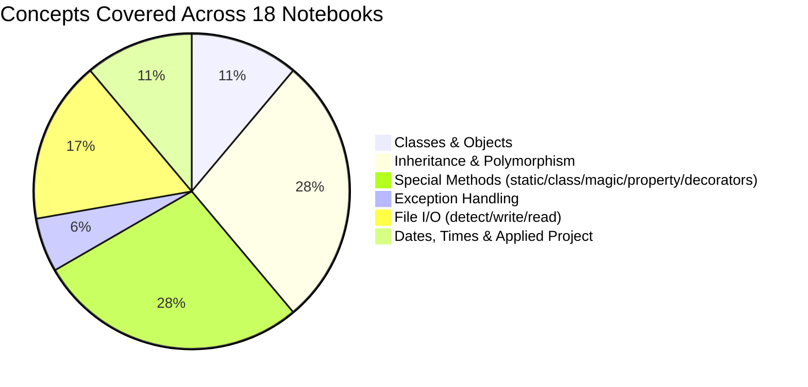
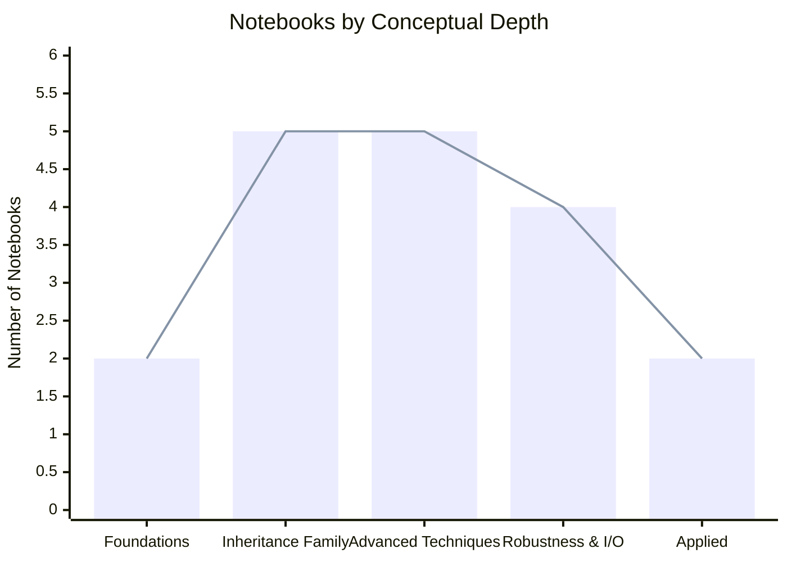
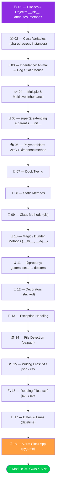

<div align="center">


<br/>

[](https://python.org)
[](https://jupyter.org)
[](https://www.youtube.com/@BroCodez)
[](#)

[](https://github.com/MuhammadZafran33/Algorithm-Arsenal)
[](https://github.com/MuhammadZafran33)
[](#)

</div>

---

## 📖 Table of Contents

- [About This Module](#-about-this-module)
- [Topic Coverage](#-topic-coverage)
- [Difficulty Curve](#-difficulty-curve)
- [Notebook-by-Notebook Roadmap](#️-notebook-by-notebook-roadmap)
- [Complete Notebook Index](#-complete-notebook-index)
- [Featured Project — Alarm Clock](#-featured-project--alarm-clock-app)
- [Concept Snapshots](#-concept-snapshots)
- [Repository Map](#️-repository-map)
- [Quick Start](#-quick-start)
- [What's Next](#-whats-next-in-the-arsenal)
- [Connect](#-connect-with-me)

---

## 🧩 About This Module

**`03-Object-Oriented-Programming`** is Module 03 of my [**Algorithm Arsenal**](https://github.com/MuhammadZafran33/Algorithm-Arsenal) repository — where procedural scripts from earlier modules turn into proper **classes and objects**.

This is the deepest module in the course so far: **18 notebooks** taking OOP from a first `class` definition all the way to decorators, magic methods, file persistence, and a real working desktop app.

<table>
<tr>
<td align="center"><b>📓 Notebooks</b><br/>18</td>
<td align="center"><b>🏗️ Classes Built</b><br/>15+</td>
<td align="center"><b>⏰ Mini-Project</b><br/>1 (Alarm Clock)</td>
<td align="center"><b>📦 External Dep</b><br/><code>pygame</code> (1 notebook only)</td>
</tr>
</table>

---

## 📊 Topic Coverage



---

## 📈 Difficulty Curve



---

## 🗺️ Notebook-by-Notebook Roadmap



> 🟠 The Alarm Clock is the module's applied capstone — it pulls together `datetime`, `time`, input validation, and audio playback into one running program.

---

## 📚 Complete Notebook Index

| # | 📓 Notebook | 🎯 What It Covers |
|---|---|---|
| 01 | [`01_OOP_Python.ipynb`](<01_OOP_Python.ipynb>) | Classes as blueprints, `__init__` constructors, instance attributes & methods — built around a `Car` class |
| 02 | [`02_Class_Variables.ipynb`](<02_Class_Variables.ipynb>) | Class-level variables shared across every instance, tracking an instance counter |
| 03 | [`03_Inheritance.ipynb`](<03_Inheritance.ipynb>) | Single inheritance — an `animal` parent with `Dog`, `Cat`, `Mouse` children |
| 04 | [`04_multiple inheritance 🐟.ipynb`](<04_multiple inheritance 🐟.ipynb>) | Multiple inheritance `C(A, B)` and multilevel inheritance chains |
| 05 | [`05_super() 🔴in python.ipynb`](<05_super() 🔴in python.ipynb>) | `super()` to call and extend a parent's constructor/methods — `Shape` → `Circle` |
| 06 | [`06_polymorphism 🎭 in python.ipynb`](<06_polymorphism 🎭 in python.ipynb>) | Polymorphism via inheritance, `ABC` + `@abstractmethod` — `Shape` → `Circle` / `Square` |
| 07 | [`07_ duck typing 🦆 in python.ipynb`](<07_ duck typing 🦆 in python.ipynb>) | Duck typing — unrelated classes (`Dog`, `Cat`, `Car`) sharing a `.speak()` interface |
| 08 | [`08_static methods ⚡in Python.ipynb`](<08_static methods ⚡in Python.ipynb>) | `@staticmethod` for utility logic that doesn't touch instance/class state |
| 09 | [`09_class methods 🏫 in Python.ipynb`](<09_class methods 🏫 in Python.ipynb>) | `@classmethod` and `cls` — a live student-counter across all instances |
| 10 | [`10_magic methods 🌟 in python.ipynb`](<10_magic methods 🌟 in python.ipynb>) | Dunder methods — `__init__`, `__str__`, `__eq__` and how Python calls them implicitly |
| 11 | [`11_@property ⚙ in python.ipynb`](<11_@property ⚙ in python.ipynb>) | `@property` decorator — getters, setters & deleters on a `Rectangle` class |
| 12 | [`12_decorators 🎊 in python.ipynb`](<12_decorators 🎊 in python.ipynb>) | Function decorators, including stacking multiple decorators on one function |
| 13 | [`13_exception handling 🚦in python.ipynb`](<13_exception handling 🚦in python.ipynb>) | `try` / `except` / `finally` with targeted exceptions (`ZeroDivisionError`, `ValueError`) |
| 14 | [`14_file detection 🕵️‍♂️ in python.ipynb`](<14_file detection 🕵‍♂ in python.ipynb>) | `os.path.exists()`, `.isfile()`, `.isdir()` — checking paths before touching them |
| 15 | [`15_writing files ✍️ in python.ipynb`](<15_writing files ✍ in python.ipynb>) | Writing `.txt`, `.json`, and `.csv` files, handling `FileExistsError` |
| 16 | [`16_reading files 🔍 in python.ipynb`](<16_reading files 🔍 in python.ipynb>) | Reading `.txt`, `.json`, and `.csv` files back, handling `FileNotFoundError` |
| 17 | [`17_dates & times 📅 in python.ipynb`](<17_dates & times 📅 in python.ipynb>) | The `datetime` module — `date`, `time`, `datetime.now()`, and custom formatting |
| 18 | [`18_⭐ alarm clock ⏰ game.ipynb`](<18_⭐ alarm clock ⏰ game.ipynb>) | 🏆 **Capstone project** — a working alarm clock app (see below) |

---

## ⏰ Featured Project — Alarm Clock App

The module closes with a real, runnable program rather than another isolated snippet:

<table>
<tr>
<td width="60%" valign="top">

**What it does**
- Takes a target time from the user in `HH:MM:SS` format
- Validates the input with `datetime.strptime()` and re-prompts on bad formats
- Continuously checks the current time against the target using `datetime.now()`
- Plays an audio file through **`pygame`** the moment the times match

**Concepts it ties together**
`datetime` • `time.sleep()` polling • input validation • `try`/`except` • external audio playback

</td>
<td width="40%" valign="top">

```python
import datetime, time, pygame

def set_alarm(alarm_time):
    try:
        alarm_time = datetime.datetime.strptime(
            alarm_time, "%H:%M:%S"
        ).strftime("%H:%M:%S")
    except ValueError:
        print("Use HH:MM:SS format!")
        return

    print(f"⏰ Alarm set for {alarm_time}")
    while True:
        now = datetime.datetime.now().strftime("%H:%M:%S")
        if now == alarm_time:
            pygame.mixer.init()
            pygame.mixer.music.load("alarm_sound.mp3")
            pygame.mixer.music.play()
            break
        time.sleep(1)
```

</td>
</tr>
</table>

---

## 💡 Concept Snapshots

<details>
<summary>🏗️ <strong>Classes & Objects</strong> — click to expand</summary>

```python
class Car:
    def __init__(self, model, year, color, for_sale):
        self.model    = model
        self.year     = year
        self.color    = color
        self.for_sale = for_sale

    def drive(self):
        print(f"You drive the {self.color} {self.model}")

car1 = Car("Mustang", 2026, "Red", False)
car1.drive()   # You drive the Red Mustang
```

</details>

<details>
<summary>🧬 <strong>Inheritance & <code>super()</code></strong> — click to expand</summary>

```python
class Shape:
    def __init__(self, color, is_filled):
        self.color, self.is_filled = color, is_filled

    def describe(self):
        state = "filled" if self.is_filled else "not filled"
        print(f"It is {self.color} and {state}")

class Circle(Shape):
    def __init__(self, color, is_filled, radius):
        super().__init__(color, is_filled)   # reuse the parent's constructor
        self.radius = radius

c = Circle("blue", True, 5)
c.describe()   # It is blue and filled
```

</details>

<details>
<summary>🎭 <strong>Polymorphism & Duck Typing</strong> — click to expand</summary>

```python
from abc import ABC, abstractmethod

class Shape(ABC):
    @abstractmethod
    def area(self): pass

class Circle(Shape):
    def __init__(self, radius): self.radius = radius
    def area(self): return 3.14 * self.radius ** 2

class Square(Shape):
    def __init__(self, side): self.side = side
    def area(self): return self.side ** 2

for shape in [Circle(4), Square(3)]:
    print(f"{type(shape).__name__} area: {shape.area()}")

# --- Duck typing: no shared parent needed ---
class Car:
    def speak(self): print("HONK!")

for thing in [Circle(1), Car()]:
    if hasattr(thing, "speak"):
        thing.speak()
```

</details>

<details>
<summary>⚙️ <strong>Static / Class / Magic Methods & <code>@property</code></strong> — click to expand</summary>

```python
class Student:
    count = 0
    def __init__(self, name, gpa):
        self.name, self.gpa = name, gpa
        Student.count += 1

    def __str__(self):                 # magic method
        return f"{self.name} ({self.gpa} GPA)"

    @classmethod
    def get_count(cls):
        return f"Total students: {cls.count}"

    @staticmethod
    def is_valid_gpa(gpa):
        return 0.0 <= gpa <= 4.0

class Rectangle:
    def __init__(self, width, height):
        self._width = width
        self._height = height

    @property
    def area(self):                    # read like an attribute
        return self._width * self._height

r = Rectangle(4, 5)
print(r.area)                          # 20 — no parentheses needed
```

</details>

<details>
<summary>🎊 <strong>Decorators</strong> — click to expand</summary>

```python
def add_sprinkles(func):
    def wrapper(*args, **kwargs):
        print("*You add sprinkles 🎊*")
        return func(*args, **kwargs)
    return wrapper

def add_fudge(func):
    def wrapper(*args, **kwargs):
        print("*You add fudge 🍫*")
        return func(*args, **kwargs)
    return wrapper

@add_sprinkles
@add_fudge
def get_ice_cream(flavor):
    print(f"Here's your {flavor} ice cream!")

get_ice_cream("vanilla")
# *You add sprinkles 🎊*
# *You add fudge 🍫*
# Here's your vanilla ice cream!
```

</details>

<details>
<summary>🚦 <strong>Exceptions & File I/O</strong> — click to expand</summary>

```python
import json

try:
    number = int(input("Enter a number to divide 10: "))
    print(f"Result: {10 / number}")
except ZeroDivisionError:
    print("Can't divide by zero!")
except ValueError:
    print("That's not a valid number.")
finally:
    print("Done.")

# Persisting data
employee = {"name": "Spongebob", "age": 30, "job": "Cook"}
with open("employee.json", "w") as f:
    json.dump(employee, f, indent=4)

with open("employee.json", "r") as f:
    print(json.load(f)["name"])   # Spongebob
```

</details>

---

## 🗂️ Repository Map

```
📦 Algorithm-Arsenal/
└── 🐍 Python By Bro Code/
    ├── 📁 01-Python-Fundamentals/         print, loops, strings, mini-projects
    ├── 📁 02-Data-Structures-and-Logic/   Lists, Dicts, Functions, 8 mini-games
    ├── 📁 03-Object-Oriented-Programming/ ◄── YOU ARE HERE (18 notebooks)
    ├── 📁 04-GUI-and-APIs/                Multithreading, REST APIs, PyQt5 GUIs
    └── 📁 Projects/                       Standalone write-ups of select mini-projects
```

> The wider [**Algorithm Arsenal**](https://github.com/MuhammadZafran33/Algorithm-Arsenal) repo also holds my Data Science / ML coursework — and will soon include internship deliverables and ML/DL project work as those land.

---

## ⚡ Quick Start

```bash
# 1. Clone the repository
git clone https://github.com/MuhammadZafran33/Algorithm-Arsenal.git

# 2. Navigate to this module
cd "Algorithm-Arsenal/Python By Bro Code/03-Object-Oriented-Programming"

# 3. Most notebooks are pure stdlib — just launch Jupyter
jupyter notebook 01_OOP_Python.ipynb

# 4. The Alarm Clock notebook (18) needs one extra package:
pip install pygame
```

---

## 🚀 What's Next in the Arsenal


Coming soon to the wider Arsenal: **internship deliverables** and **Machine Learning / Deep Learning projects**, built on these exact OOP foundations — classes for models, pipelines, and data objects all trace back here.

---

## 🤝 Connect with Me

<div align="center">

[](https://github.com/MuhammadZafran33)
[](https://www.fiverr.com/muh_zafran)

<br/>

**Muhammad Zafran** — BS Artificial Intelligence
Institute of Management Sciences (IM|Sciences), Peshawar, Pakistan 🇵🇰

<br/>

⭐ **Star [Algorithm Arsenal](https://github.com/MuhammadZafran33/Algorithm-Arsenal)** if this helped you on your own Python journey!


</div>
