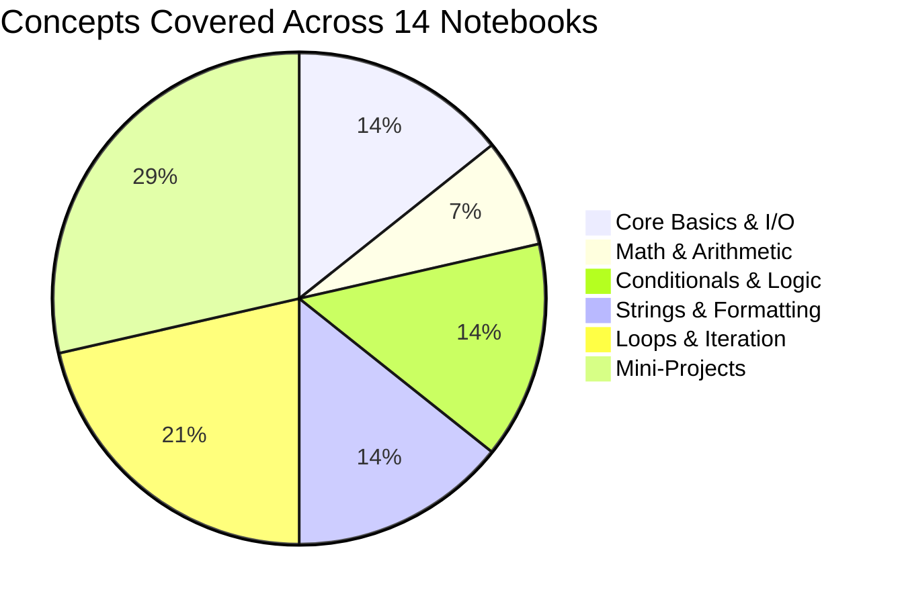
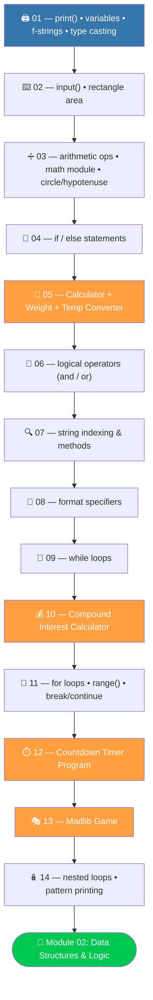

<div align="center">


<br/>

[](https://python.org)
[](https://jupyter.org)
[](https://www.youtube.com/@BroCodez)
[](#)

[](https://github.com/MuhammadZafran33/Algorithm-Arsenal)
[](https://github.com/MuhammadZafran33)
[](#)

</div>

---

## 📖 Table of Contents

- [About This Module](#-about-this-module)
- [Topic Coverage](#-topic-coverage)
- [Notebook-by-Notebook Roadmap](#️-notebook-by-notebook-roadmap)
- [Complete Notebook Index](#-complete-notebook-index)
- [Featured Mini-Projects](#-featured-mini-projects)
- [Concept Snapshots](#-concept-snapshots)
- [Repository Map](#️-repository-map)
- [Quick Start](#-quick-start)
- [What's Next](#-whats-next-in-the-arsenal)
- [Connect](#-connect-with-me)

---

## 🐍 About This Module

**`01-Python-Fundamentals`** is the first module of my [**Algorithm Arsenal**](https://github.com/MuhammadZafran33/Algorithm-Arsenal) repository — a hands-on rebuild of the **Bro Code Python Full Course**, done entirely in Jupyter Notebooks, one concept at a time.

Every notebook here was typed out, run, and debugged by hand — no copy-pasting. It's the raw syntax foundation everything after it (data structures, OOP, GUIs, and eventually ML/DL) is built on top of.

<table>
<tr>
<td align="center"><b>📓 Notebooks</b><br/>14</td>
<td align="center"><b>🛠️ Mini-Projects</b><br/>4</td>
<td align="center"><b>📦 Dependencies</b><br/>0 (stdlib only)</td>
<td align="center"><b>🎯 Format</b><br/>Jupyter (.ipynb)</td>
</tr>
</table>

---

## 📊 Topic Coverage



---

## 🗺️ Notebook-by-Notebook Roadmap



> 🟠 Orange nodes are the four **applied mini-projects** built along the way.

---

## 📚 Complete Notebook Index

| # | 📓 Notebook | 🎯 What It Covers |
|---|---|---|
| 01 | [`01_DayOfCode.ipynb`](./01_DayOfCode.ipynb) | `print()`, variables, f-strings, `type()`, type casting basics |
| 02 | [`02Inputs.ipynb`](./02Inputs.ipynb) | `input()`, casting user input, a small rectangle-area calculator |
| 03 | [`03AritmeticOprt.ipynb`](./03AritmeticOprt.ipynb) | Arithmetic operators, `round()` `abs()` `pow()` `max()` `min()`, the `math` module, circle circumference/area, right-triangle hypotenuse |
| 04 | [`04_If_state.ipynb`](./04_If_state.ipynb) | `if` / `else` branching with real conditions (age check, y/n prompts, empty-string checks) |
| 05 | [`05_Calculator_...Program.ipynb`](./05_Calculator_Weight_Temprature_conversion_Program.ipynb) | 🛠️ **Mini-project** — basic calculator, weight converter (kg ⇄ lbs), temperature converter (°C ⇄ °F) |
| 06 | [`06_Logical_Operators...ipynb`](./06_Logical_Operators_conditional_expressions.ipynb) | Logical operators `and` / `or` in compound conditional expressions |
| 07 | [`07_Indexing_methods.ipynb`](./07_Indexing_methods.ipynb) | String slicing `[start:stop:step]`, `.find()` `.rfind()` `.upper()` `.lower()` `.isdigit()` `.isalpha()` `.count()` `.replace()`, username-validation task |
| 08 | [`08_format_spacifiers.ipynb`](./08_format_spacifiers.ipynb) | f-string format specifiers — decimal precision, padding, alignment (`<` `>` `^`), sign flags, thousands separators |
| 09 | [`09_while_loop.ipynb`](./09_while_loop.ipynb) | `while` loops for input validation and sentinel-controlled menus |
| 10 | [`10_Compund_interest_calculator.ipynb`](./10_Compund_interest_calculator.ipynb) | 🛠️ **Mini-project** — compound interest calculator, solved two ways (`while <= 0` vs. `while True` + `break`) |
| 11 | [`11_For_Loop.ipynb`](./11_For_Loop.ipynb) | `for` loops, `range()`, `reversed()`, iterating strings, `continue` / `break` |
| 12 | [`12_count_Down_Timer_Program.ipynb`](./12_count_Down_Timer_Program.ipynb) | 🛠️ **Mini-project** — countdown timer with live `HH:MM:SS` formatting using `time.sleep()` |
| 13 | [`13_mandlib_game_user_inputs.ipynb`](./13_mandlib_game_user_inputs.ipynb) | 🛠️ **Mini-project** — Madlib-style story generator driven entirely by `input()` |
| 14 | [`14_Nested_loop.ipynb`](./14_Nested_loop.ipynb) | Nested loops, and a custom rows × columns × symbol pattern printer |

---

## 🛠️ Featured Mini-Projects

Four small applied builds sit inside this module, each combining several fundamentals into one working program:

<table>
<tr>
<td width="50%" valign="top">

**🧮 Calculator + Unit Converters**
`05_Calculator_..._Program.ipynb`
A single program that does arithmetic, converts weight (kg ⇄ lbs), and converts temperature (°C ⇄ °F) — all driven by `if`/`elif`/`else`.

</td>
<td width="50%" valign="top">

**💰 Compound Interest Calculator**
`10_Compund_interest_calculator.ipynb`
Validates principal, rate, and time with `while` loops, then computes compound interest — implemented twice to compare two validation patterns.

</td>
</tr>
<tr>
<td width="50%" valign="top">

**⏱️ Countdown Timer**
`12_count_Down_Timer_Program.ipynb`
A live terminal countdown using `time.sleep()`, formatted into a clean `HH:MM:SS` display.

</td>
<td width="50%" valign="top">

**🎭 Madlib Game**
`13_mandlib_game_user_inputs.ipynb`
Collects adjectives, nouns, and verbs from the user and weaves them into a silly generated story.

</td>
</tr>
</table>

---

## 💡 Concept Snapshots

<details>
<summary>📦 <strong>Variables, Types & Casting</strong> — click to expand</summary>

```python
name  = "Muhammad Zafran"     # str
age   = 21                    # int
gpa   = 3.8                   # float

print(type(age))              # <class 'int'>
age   = str(age)              # cast int -> str
gpa   = int(gpa)              # cast float -> int (truncates)

print(f"Hi, I'm {name} — {age} years old, GPA (as int): {gpa}")
```

</details>

<details>
<summary>➗ <strong>Arithmetic & the <code>math</code> Module</strong> — click to expand</summary>

```python
import math

radius = 7
print(round(math.pi, 2))                 # 3.14
print(f"Circumference: {2 * math.pi * radius:.2f}")
print(f"Area: {math.pi * radius ** 2:.2f}")

a, b = 3, 4
c = math.sqrt(a ** 2 + b ** 2)            # Pythagorean theorem
print(f"Hypotenuse: {c}")                 # 5.0
```

</details>

<details>
<summary>🔍 <strong>String Indexing & Methods</strong> — click to expand</summary>

```python
credit_number = "1234-5678-9012-3456"

print(credit_number[-4:])                 # "3456"
print(credit_number[::-1])                # reversed string
print(credit_number[1:9:2])                # step slicing

username = "muh_zafran"
if len(username) > 12:
    print("Too long")
elif not username.isalpha() and "_" not in username:
    print("Invalid characters")
else:
    print(f"Welcome {username}")
```

</details>

<details>
<summary>🎨 <strong>Format Specifiers</strong> — click to expand</summary>

```python
price = 3098.14159

print(f"${price:.2f}")     # 2 decimal places   -> $3098.14
print(f"${price:,.2f}")    # thousands separator -> $3,098.14
print(f"${price:>12,.2f}") # right-aligned in a 12-char field
print(f"{price:+.1f}")     # force sign          -> +3098.1
```

</details>

<details>
<summary>🔁 <strong>Loops — While, For & Nested</strong> — click to expand</summary>

```python
# Input validation with while
age = int(input("Enter your age: "))
while age < 0:
    print("Age can't be negative.")
    age = int(input("Enter your age: "))

# for + range + reversed
for x in reversed(range(1, 11, 2)):
    print(x, end=" ")

# Nested loop — build a symbol grid
rows, cols, symbol = 3, 5, "*"
for r in range(rows):
    for c in range(cols):
        print(symbol, end="")
    print()
```

</details>

---

## 🗂️ Repository Map

```
📦 Algorithm-Arsenal/
└── 🐍 Python By Bro Code/
    ├── 📁 01-Python-Fundamentals/        ◄── YOU ARE HERE (14 notebooks)
    ├── 📁 02-Data-Structures-and-Logic/  Lists, Sets, Tuples, Dicts, Functions,
    │                                     Comprehensions, Modules, Scope + 8 games
    ├── 📁 03-Object-Oriented-Programming/ Classes, Inheritance, Polymorphism,
    │                                      Decorators, Files, Exceptions
    ├── 📁 04-GUI-and-APIs/               Multithreading, REST APIs, PyQt5 GUIs
    └── 📁 Projects/                      Standalone write-ups of the mini-projects above
```

> The wider [**Algorithm Arsenal**](https://github.com/MuhammadZafran33/Algorithm-Arsenal) repo also holds my Data Science / ML coursework — and will soon include internship deliverables and ML/DL project work as those land.

---

## ⚡ Quick Start

```bash
# 1. Clone the repository
git clone https://github.com/MuhammadZafran33/Algorithm-Arsenal.git

# 2. Navigate to this module
cd "Algorithm-Arsenal/Python By Bro Code/01-Python-Fundamentals"

# 3. Launch Jupyter and open any notebook — pure stdlib, nothing to install
jupyter notebook 01_DayOfCode.ipynb
```

> No `pip install` needed — every notebook in this module runs on the Python standard library alone.

---

## 🎓 Course & Reference Links

| Resource | Why It's Here |
|---|---|
| 🎥 [Bro Code — Python Full Course](https://www.youtube.com/@BroCodez) | The course this whole module follows |
| 📘 [Official Python Docs](https://docs.python.org/3/) | Ground-truth reference for every builtin used |
| 📋 [Python Cheatsheet](https://www.pythoncheatsheet.org) | Fast syntax lookup while working through notebooks |

---

## 🚀 What's Next in the Arsenal


Coming soon to the wider Arsenal: **internship deliverables** and **Machine Learning / Deep Learning projects**, built on this exact foundation.

---

## 🤝 Connect with Me

<div align="center">

[](https://github.com/MuhammadZafran33)
[](https://www.fiverr.com/muh_zafran)

<br/>

**Muhammad Zafran** — BS Artificial Intelligence
Institute of Management Sciences (IM|Sciences), Peshawar, Pakistan 🇵🇰

<br/>

⭐ **Star [Algorithm Arsenal](https://github.com/MuhammadZafran33/Algorithm-Arsenal)** if this helped you on your own Python journey!


</div>
