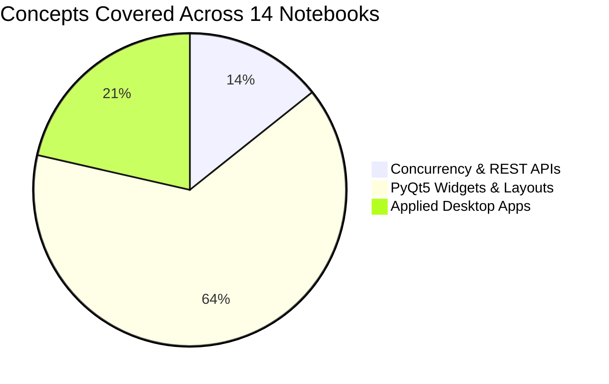
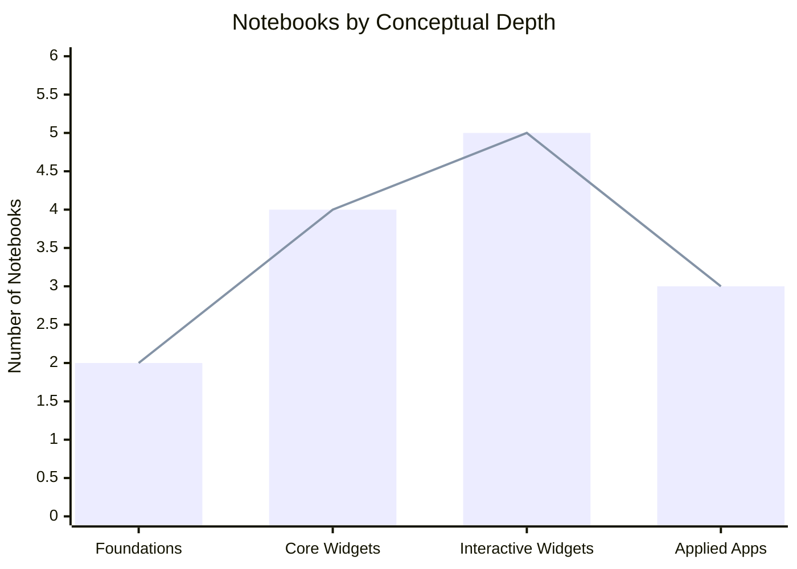
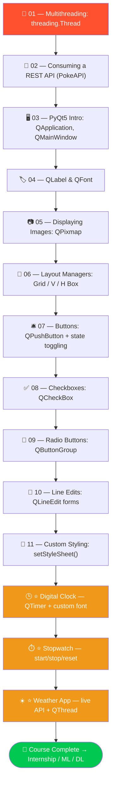
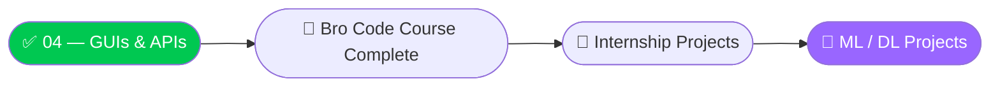

<div align="center">


<br/>

[](https://python.org)
[](https://pypi.org/project/PyQt5/)
[](https://www.youtube.com/@BroCodez)
[](#)

[](https://github.com/MuhammadZafran33/Algorithm-Arsenal)
[](https://github.com/MuhammadZafran33)
[](#)

</div>

---

## 📖 Table of Contents

- [About This Module](#-about-this-module)
- [Topic Coverage](#-topic-coverage)
- [Difficulty Curve](#-difficulty-curve)
- [Notebook-by-Notebook Roadmap](#️-notebook-by-notebook-roadmap)
- [Complete Notebook Index](#-complete-notebook-index)
- [Featured Projects](#-featured-projects)
- [Concept Snapshots](#-concept-snapshots)
- [Repository Map](#️-repository-map)
- [Quick Start](#-quick-start)
- [What's Next](#-whats-next-in-the-arsenal)
- [Connect](#-connect-with-me)

---

## 🖥️ About This Module

**`04-GUI-and-APIs`** is Module 04 — the **final module** of the Bro Code Python course in this repo — and the point where everything stops living in a terminal.

This module leaves plain `print()` output behind: **concurrency** with `threading`, **live data** from real REST APIs, and full **desktop GUI apps** built with PyQt5. It closes with three working applications instead of isolated snippets.

<table>
<tr>
<td align="center"><b>📓 Notebooks</b><br/>14</td>
<td align="center"><b>🖥️ Desktop Apps Built</b><br/>3</td>
<td align="center"><b>🌐 Live API Used</b><br/>Open-Meteo (no key)</td>
<td align="center"><b>📦 New Dependencies</b><br/><code>PyQt5</code>, <code>requests</code></td>
</tr>
</table>

---

## 📊 Topic Coverage



---

## 📈 Difficulty Curve



---

## 🗺️ Notebook-by-Notebook Roadmap



> 🟠 The last three notebooks are full applications, not exercises — each one runs as a standalone desktop window.

---

## 📚 Complete Notebook Index

| # | 📓 Notebook | 🎯 What It Covers |
|---|---|---|
| 01 | [`01_multithreading 🧵in python.ipynb`](<01_multithreading 🧵in python.ipynb>) | `threading.Thread` for concurrent, I/O-bound tasks — chores running in parallel instead of sequentially |
| 02 | [`02_request API data ↩️in python.ipynb`](<02_request API data ↩️in python.ipynb>) | The `requests` library — `GET` calls, status codes, JSON parsing, against the public **PokeAPI** |
| 03 | [`03_PyQt5 GUI intro 🖥️ in python.ipynb`](<03_PyQt5 GUI intro 🖥️ in python.ipynb>) | `QApplication` / `QMainWindow`, window title, geometry, and icon customization |
| 04 | [`04_PyQt5 labels 🏷️ in python.ipynb`](<04_PyQt5 labels 🏷️ in python.ipynb>) | `QLabel` + `QFont` — placing and styling text on a window |
| 05 | [`05_PyQt5 images 📷 in python.ipynb`](<05_PyQt5 images 📷 in python.ipynb>) | `QPixmap` — rendering images inside a `QLabel` |
| 06 | [`06_PyQt5 layout managers 🧲 in python.ipynb`](<06_PyQt5 layout managers 🧲 in python.ipynb>) | `QGridLayout`, `QVBoxLayout`, `QHBoxLayout` — arranging widgets responsively |
| 07 | [`07_PyQt5 buttons 🛎️ in python.ipynb`](<07_PyQt5 buttons 🛎️ in python.ipynb>) | `QPushButton` wired to a click handler that toggles UI state |
| 08 | [`08_PyQt5 checkboxes ✅ in python.ipynb`](<08_PyQt5 checkboxes ✅ in python.ipynb>) | `QCheckBox` and reading its checked state |
| 09 | [`09_PyQt5 radio buttons 🔘 in python.ipynb`](<09_PyQt5 radio buttons 🔘 in python.ipynb>) | `QRadioButton` grouped with `QButtonGroup` inside a `QGroupBox` — a payment/delivery selector UI |
| 10 | [`10_PyQt5 line edits 💬 in python.ipynb`](<10_PyQt5 line edits 💬 in python.ipynb>) | `QLineEdit` text input paired with a submit `QPushButton` |
| 11 | [`11_PyQt5 CSS styles 🎨 in python.ipynb`](<11_PyQt5 CSS styles 🎨 in python.ipynb>) | `setStyleSheet()` — Qt's CSS-like syntax for custom-styled buttons |
| ⭐ | [`digital clock program 🕒.ipynb`](<⭐ digital clock program 🕒 in python.ipynb>) | 🏆 **Project** — a neon-style digital clock, `QTimer` + custom `.ttf` font |
| ⭐ | [`stopwatch program ⏱.ipynb`](<⭐ stopwatch program ⏱ in python.ipynb>) | 🏆 **Project** — a working stopwatch with start / stop / reset and centisecond precision |
| ⭐ | [`weather API app ☀️.ipynb`](<⭐ weather API app ☀️ in python.ipynb>) | 🏆 **Project** — live weather lookup by city name, threaded so the UI never freezes |

---

## 🏆 Featured Projects

Three standalone desktop apps close out the module — each one runs, not just demonstrates.

<table>
<tr>
<td width="33%" valign="top">

**🕒 Digital Clock**

A live-updating clock styled like an LED display — black background, neon-green digits, custom `DS-DIGIT.TTF` font loaded via `QFontDatabase`, refreshed every second with `QTimer`.

</td>
<td width="33%" valign="top">

**⏱️ Stopwatch**

Start / Stop / Reset controls driving a `QTimer`-based counter, displayed to the centisecond (`00:00:00.00`) in the same neon LED style as the clock.

</td>
<td width="33%" valign="top">

**☀️ Weather App**

Type a city, get live conditions. No API key required — geocodes the city then fetches current weather from **Open-Meteo**, all on a background `QThread` so the interface stays responsive.

</td>
</tr>
</table>

### How the Weather App avoids freezing the UI

```python
class WeatherWorker(QThread):
    data_fetched   = pyqtSignal(dict)
    error_occurred = pyqtSignal(str)

    def __init__(self, city_name):
        super().__init__()
        self.city_name = city_name

    def run(self):
        # 1. Geocode the city name -> lat/lon (Open-Meteo, no key needed)
        geo = requests.get(
            f"https://geocoding-api.open-meteo.com/v1/search?name={self.city_name}"
        ).json()

        if not geo.get("results"):
            self.error_occurred.emit("City not found.")
            return

        lat, lon = geo["results"][0]["latitude"], geo["results"][0]["longitude"]

        # 2. Fetch live weather for those coordinates
        weather = requests.get(
            f"https://api.open-meteo.com/v1/forecast?latitude={lat}&longitude={lon}"
            f"&current=temperature_2m,relative_humidity_2m,wind_speed_10m"
        ).json()

        self.data_fetched.emit(weather["current"])   # hand results back to the UI thread
```

The GUI starts this worker on a background thread and connects to its signals — so a slow network call never locks up the window.

---

## 💡 Concept Snapshots

<details>
<summary>🧵 <strong>Multithreading</strong> — click to expand</summary>

```python
import threading, time

def walk_dog():
    time.sleep(8)
    print("Finished walking the dog")

def take_out_trash():
    time.sleep(2)
    print("Trash taken out")

# Sequential: ~10 seconds total
# Threaded: both run concurrently, ~8 seconds total
t1 = threading.Thread(target=walk_dog)
t2 = threading.Thread(target=take_out_trash)
t1.start(); t2.start()
t1.join();  t2.join()
```

</details>

<details>
<summary>🔗 <strong>Calling a REST API</strong> — click to expand</summary>

```python
import requests

def get_pokemon_info(name):
    url = f"https://pokeapi.co/api/v2/pokemon/{name}"
    response = requests.get(url)

    if response.status_code == 200:
        return response.json()
    print(f"Failed to retrieve data: {response.status_code}")

pikachu = get_pokemon_info("pikachu")
print(pikachu["height"], pikachu["weight"])
```

</details>

<details>
<summary>🖥️ <strong>A Minimal PyQt5 Window</strong> — click to expand</summary>

```python
import sys
from PyQt5.QtWidgets import QApplication, QMainWindow, QLabel
from PyQt5.QtGui import QFont

class MainWindow(QMainWindow):
    def __init__(self):
        super().__init__()
        self.setWindowTitle("My First GUI")
        self.setGeometry(700, 300, 500, 500)

        label = QLabel("Hello!", self)
        label.setFont(QFont("Arial", 40))
        label.setGeometry(0, 0, 500, 100)

app = QApplication(sys.argv)
window = MainWindow()
window.show()
sys.exit(app.exec_())
```

</details>

<details>
<summary>🎨 <strong>Widgets, Layouts & Styling</strong> — click to expand</summary>

```python
from PyQt5.QtWidgets import QPushButton, QRadioButton, QButtonGroup, QVBoxLayout

# Toggling button state
self.button = QPushButton("Say Hello")
self.button.clicked.connect(self.toggle_message)

# Grouping radio buttons so only one can be selected
self.group = QButtonGroup(self)
for option in ["Visa", "Mastercard", "PayPal"]:
    btn = QRadioButton(option)
    self.group.addButton(btn)

# Qt's CSS-like styling
self.button.setStyleSheet("""
    QPushButton {
        background-color: #FF512F;
        color: white;
        border-radius: 8px;
        padding: 8px 16px;
    }
    QPushButton:hover { background-color: #F09819; }
""")
```

</details>

---

## 🗂️ Repository Map

```
📦 Algorithm-Arsenal/
└── 🐍 Python By Bro Code/
    ├── 📁 01-Python-Fundamentals/         print, loops, strings, mini-projects
    ├── 📁 02-Data-Structures-and-Logic/   Lists, Dicts, Functions, 8 mini-games
    ├── 📁 03-Object-Oriented-Programming/ Classes, Inheritance, Decorators, Files
    ├── 📁 04-GUI-and-APIs/                ◄── YOU ARE HERE (14 notebooks, 3 apps)
    └── 📁 Projects/                       Standalone write-ups of select mini-projects
```

> The wider [**Algorithm Arsenal**](https://github.com/MuhammadZafran33/Algorithm-Arsenal) repo also holds my Data Science / ML coursework — and will soon include internship deliverables and ML/DL project work as those land.

---

## ⚡ Quick Start

```bash
# 1. Clone the repository
git clone https://github.com/MuhammadZafran33/Algorithm-Arsenal.git

# 2. Navigate to this module
cd "Algorithm-Arsenal/Python By Bro Code/04-GUI-and-APIs"

# 3. Install the two new dependencies this module introduces
pip install PyQt5 requests

# 4. Launch a notebook and run all cells — GUI apps open in their own window
jupyter notebook "⭐ weather API app ☀️ in python.ipynb"
```

> The Digital Clock and Stopwatch notebooks load `DS-DIGIT.TTF` from this same folder — keep it alongside the notebooks when running them.

---

## 🚀 What's Next in the Arsenal



This module wraps the **Bro Code Python Full Course** track in the Arsenal. Next up: **internship deliverables** and **Machine Learning / Deep Learning projects** — the API-consumption and threading patterns from this module carry straight over into calling model endpoints and keeping ML-powered UIs responsive.

---

## 🤝 Connect with Me

<div align="center">

[](https://github.com/MuhammadZafran33)
[](https://www.fiverr.com/muh_zafran)

<br/>

**Muhammad Zafran** — BS Artificial Intelligence
Institute of Management Sciences (IM|Sciences), Peshawar, Pakistan 🇵🇰

<br/>

⭐ **Star [Algorithm Arsenal](https://github.com/MuhammadZafran33/Algorithm-Arsenal)** if this helped you on your own Python journey!


</div>
