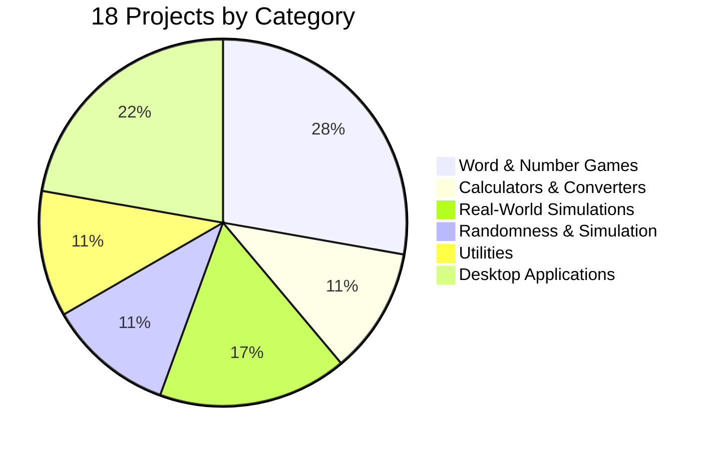
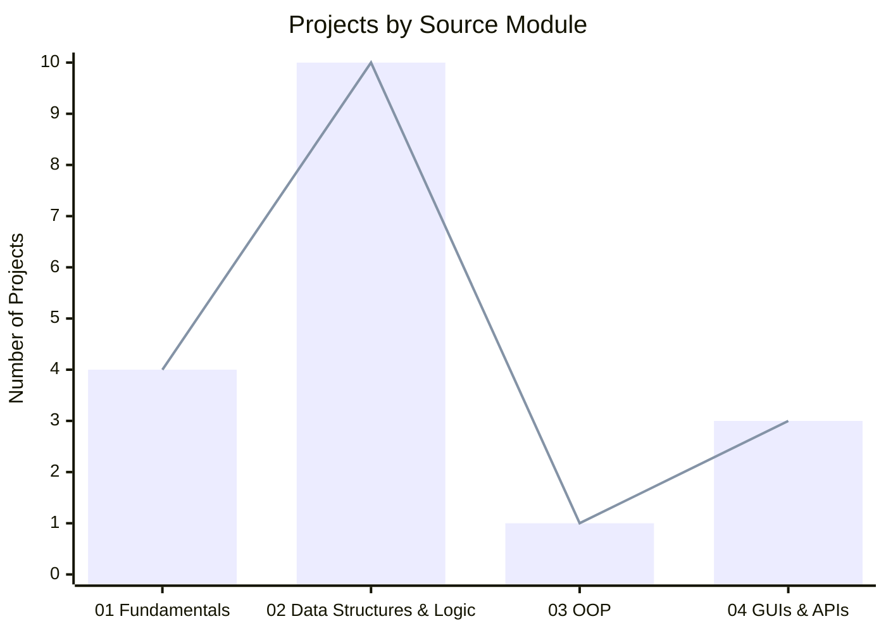
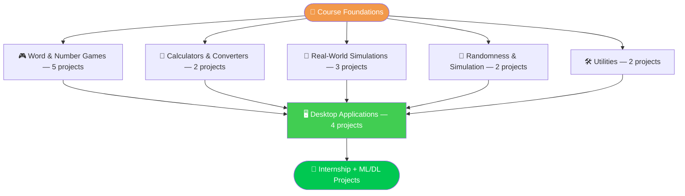
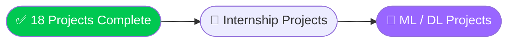

<div align="center">


<br/>

[](https://python.org)
[](https://jupyter.org)
[](https://pypi.org/project/PyQt5/)
[](https://www.youtube.com/@BroCodez)

[](#-complete-project-gallery)
[](https://github.com/MuhammadZafran33/Algorithm-Arsenal)
[](https://github.com/MuhammadZafran33)

</div>

---

## 📖 Table of Contents

- [About This Folder](#-about-this-folder)
- [Project Categories](#-project-categories)
- [Complexity Curve](#-complexity-curve)
- [From Terminal to Desktop](#️-from-terminal-to-desktop)
- [Complete Project Gallery](#-complete-project-gallery)
- [Featured Projects](#-featured-projects)
- [Concept Snapshots](#-concept-snapshots)
- [Repository Map](#️-repository-map)
- [Quick Start](#-quick-start)
- [What's Next](#-whats-next-in-the-arsenal)
- [Connect](#-connect-with-me)

---

## ⭐ About This Folder

**`Projects`** is the showcase layer of my [**Algorithm Arsenal**](https://github.com/MuhammadZafran33/Algorithm-Arsenal) repository — **18 standalone programs** pulled out of the Bro Code course modules and given their own dedicated folder, each one a complete, runnable piece of work rather than a syntax exercise.

They span the full arc of the course: text-based games and simulations built on fundamentals and data structures, through to real **PyQt5 desktop applications** with live API data.

<table>
<tr>
<td align="center"><b>⭐ Total Projects</b><br/>18</td>
<td align="center"><b>🎮 Terminal Programs</b><br/>14</td>
<td align="center"><b>🖥️ Desktop Apps</b><br/>4</td>
<td align="center"><b>📁 Structure</b><br/>1 folder per project</td>
</tr>
</table>

---

## 📊 Project Categories



---

## 📈 Complexity Curve



---

## 🗺️ From Terminal to Desktop



---

## 📚 Complete Project Gallery

| # | ⭐ Project | 🏷️ Category | 🎯 What It Does |
|---|---|---|---|
| 01 | [Madlibs Game 🎭](<01 ⭐ madlibs game>) | Word & Number Games | `input()`-driven story generator that stitches user-supplied words into a silly narrative |
| 02 | [Calculator + Converters 🧮🌡️](<02 ⭐ calculator program  ⭐ temperature conversion program 🌡️>) | Calculators & Converters | Combined arithmetic calculator, weight (kg⇄lbs) and temperature (°C⇄°F) converter |
| 03 | [Compound Interest Calculator 💵](<⭐ compound interest calculator 💵>) | Calculators & Converters | Validates principal/rate/time inputs, computes compound growth two different ways |
| 04 | [Countdown Timer ⌛](<04 ⭐ countdown timer program ⌛>) | Utilities | Live `HH:MM:SS` countdown built with `time.sleep()` |
| 05 | [Shopping Cart 🛒](<05 ⭐ shopping cart program 🛒>) | Real-World Simulations | `while`-loop cart builder tracking items and prices, prints an itemized receipt + total |
| 06 | [Quiz Game 💯](<06 ⭐ quiz game 💯>) | Word & Number Games | Multiple-choice trivia engine driven by tuples of questions/options/answers with a live score tally |
| 07 | [Concession Stand 🍿](<07 ⭐ concession stand program 🍿>) | Real-World Simulations | Dictionary-based menu system with a running cart total and formatted receipt |
| 08 | [Number Guessing Game 🔢](<08 ⭐ number guessing game 🔢>) | Word & Number Games | `random.randint` target number with a higher/lower feedback loop and guess counter |
| 09 | [Rock, Paper, Scissors 🗿](<09 ⭐ rock, paper, scissors game 🗿>) | Word & Number Games | `random.choice` computer opponent, win/lose/tie logic, replay loop |
| 10 | [Dice Roller ⚂](<10 ⭐ dice roller program ⚂>) | Randomness & Simulation | Hand-drawn ASCII dice faces using box-drawing characters, rendered for random rolls |
| 11 | [Banking Program 💰](<11 ⭐ banking program 💰>) | Real-World Simulations | Function-based deposit / withdraw / balance system with input validation |
| 12 | [Slot Machine 🎰](<12 ⭐ slot machine 🎰>) | Randomness & Simulation | Emoji reels, tiered payout multipliers, a full betting loop with balance tracking |
| 13 | [Encryption Program 🔐](<13 ⭐ encryption program 🔐>) | Utilities | Substitution cipher — a shuffled character key both encrypts and decrypts any message |
| 14 | [Hangman Game 🕺](<14 ⭐ hangman game 🕺>) | Word & Number Games | ASCII-art hangman stages, random target word, letter-guess tracking |
| 15 | [Alarm Clock ⏰](<15 ⭐ alarm clock ⏰in python>) | Desktop Applications | `datetime`-matched trigger plays an audio file via `pygame` |
| 16 | [Digital Clock 🕒](<16 ⭐ digital clock program 🕒in python>) | Desktop Applications | PyQt5 neon-style live clock using a custom `.ttf` font |
| 17 | [Stopwatch ⏱](<17 ⭐ stopwatch program ⏱in python>) | Desktop Applications | PyQt5 start / stop / reset timer with centisecond precision |
| 18 | [Weather API App ☀️](<18 ⭐ weather API app ☀️ in python>) | Desktop Applications | PyQt5 + `QThread` live weather lookup via Open-Meteo — no API key required |

> Project 03 (Compound Interest Calculator) doesn't carry a number prefix in the repo folder itself — listed here in course sequence for a clean read.

---

## 🏆 Featured Projects

Four projects that go a step beyond the rest — picked for cleanest structure or most interesting mechanics.

<table>
<tr>
<td width="50%" valign="top">

**🎰 Slot Machine**
Proper functions (`spin_row`, `print_row`, `get_payout`), docstrings, a tiered payout table, and a `main()` guarded by `if __name__ == '__main__':` — the most professionally structured script in the set.

</td>
<td width="50%" valign="top">

**🔐 Encryption Program**
A working substitution cipher: shuffle the full printable character set into a random key, then encrypt *and* decrypt any message by mapping indices between the original and shuffled lists.

</td>
</tr>
<tr>
<td width="50%" valign="top">

**⚂ Dice Roller**
Box-drawing Unicode characters (`┌─┐│└┘●`) hand-assembled into a dictionary of ASCII dice faces for values 1–6 — a nice example of building a visual layer with nothing but `string` formatting.

</td>
<td width="50%" valign="top">

**☀️ Weather API App**
The most technically ambitious build in the folder — a `QThread` worker fetches live geocoding + weather data from Open-Meteo in the background so the PyQt5 interface never freezes while waiting on the network.

</td>
</tr>
</table>

---

## 💡 Concept Snapshots

<details>
<summary>🎰 <strong>Slot Machine — Payout Logic</strong> — click to expand</summary>

```python
def get_payout(row, bet):
    """Checks for matching symbols and returns the payout multiplier."""
    payouts = {'🍒': 3, '🍉': 4, '🍋': 5, '🔔': 10, '⭐': 20}
    if row[0] == row[1] == row[2]:
        return bet * payouts[row[0]]
    return 0

# A clean win-check + tiered reward, no nested if/elif chains needed
```

</details>

<details>
<summary>🔐 <strong>Encryption — Substitution Cipher</strong> — click to expand</summary>

```python
import random, string

chars = list(" " + string.punctuation + string.digits + string.ascii_letters)
key   = chars.copy()
random.shuffle(key)                       # the "secret" mapping

def encrypt(text):
    return "".join(key[chars.index(c)] for c in text)

def decrypt(cipher):
    return "".join(chars[key.index(c)] for c in cipher)

secret = encrypt("meet me at noon")
print(decrypt(secret))                    # meet me at noon
```

</details>

<details>
<summary>🏪 <strong>Cart / Menu Pattern</strong> — shared by Shopping Cart & Concession Stand</summary>

```python
menu = {"pizza": 3.00, "nachos": 4.50, "popcorn": 6.00, "soda": 3.00}
cart, total = [], 0

print("------- MENU -------")
for item, price in menu.items():
    print(f"{item:10}: ${price:.2f}")

while True:
    choice = input("Add an item (q to checkout): ")
    if choice.lower() == "q":
        break
    if choice in menu:
        cart.append(choice)
        total += menu[choice]

print(f"\nTotal: ${total:.2f}")
```

</details>

<details>
<summary>💰 <strong>Function-Based State — Banking Program</strong> — click to expand</summary>

```python
def deposit(balance):
    amount = float(input("Enter an amount to deposit: "))
    return balance + amount if amount > 0 else balance

def withdraw(balance):
    amount = float(input("Enter an amount to withdraw: "))
    if amount > balance:
        print("Insufficient funds")
        return balance
    return balance - amount

balance = 0
balance = deposit(balance)
balance = withdraw(balance)
print(f"Your balance is ${balance:.2f}")
```

</details>

---

## 🗂️ Repository Map

```
📦 Algorithm-Arsenal/
└── 🐍 Python By Bro Code/
    ├── 📁 01-Python-Fundamentals/         print, loops, strings, mini-projects
    ├── 📁 02-Data-Structures-and-Logic/   Lists, Dicts, Functions, 8 mini-games
    ├── 📁 03-Object-Oriented-Programming/ Classes, Inheritance, Decorators, Files
    ├── 📁 04-GUI-and-APIs/                Multithreading, REST APIs, PyQt5 GUIs
    └── 📁 Projects/                       ◄── YOU ARE HERE (18 standalone builds)
```

> The wider [**Algorithm Arsenal**](https://github.com/MuhammadZafran33/Algorithm-Arsenal) repo also holds my Data Science / ML coursework — and will soon include internship deliverables and ML/DL project work as those land.

---

## ⚡ Quick Start

```bash
# 1. Clone the repository
git clone https://github.com/MuhammadZafran33/Algorithm-Arsenal.git

# 2. Navigate to the Projects folder
cd "Algorithm-Arsenal/Python By Bro Code/Projects"

# 3. Pick any project folder and open its notebook
jupyter notebook "12 ⭐ slot machine 🎰"

# 4. The last four (Alarm Clock, Digital Clock, Stopwatch, Weather App)
#    need one extra install:
pip install PyQt5 requests pygame
```

---

## 🚀 What's Next in the Arsenal



This folder is the proof-of-work layer for the whole Bro Code track — next up: **internship deliverables** and **Machine Learning / Deep Learning projects**, applying these same patterns (functions, state management, live data, responsive interfaces) to real datasets and models.

---

## 🤝 Connect with Me

<div align="center">

[](https://github.com/MuhammadZafran33)
[](https://www.fiverr.com/muh_zafran)

<br/>

**Muhammad Zafran** — BS Artificial Intelligence
Institute of Management Sciences (IM|Sciences), Peshawar, Pakistan 🇵🇰

<br/>

⭐ **Star [Algorithm Arsenal](https://github.com/MuhammadZafran33/Algorithm-Arsenal)** if this helped you on your own Python journey!


</div>
