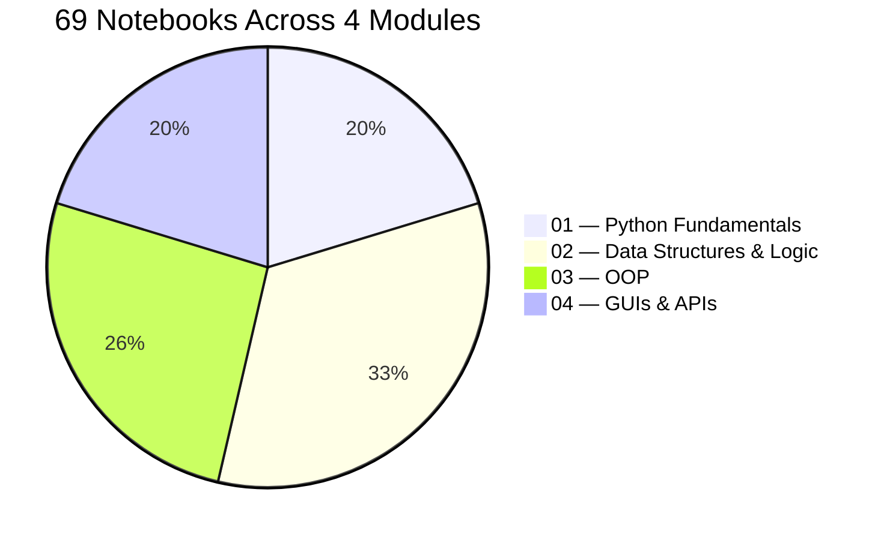
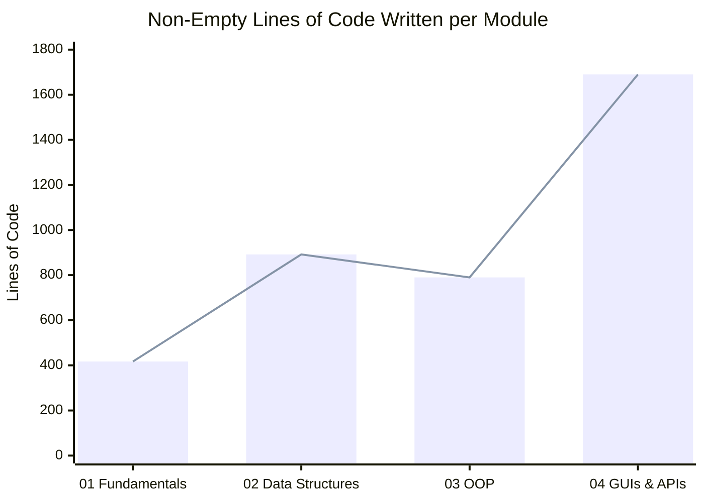
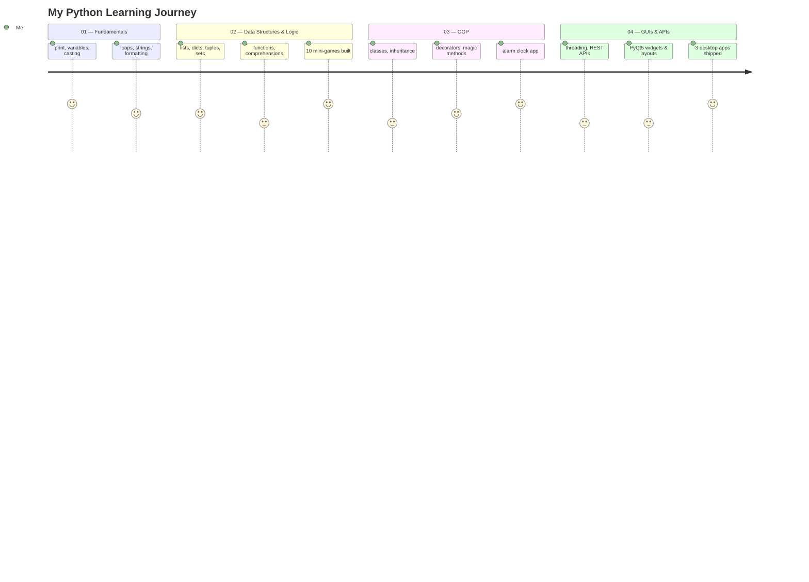
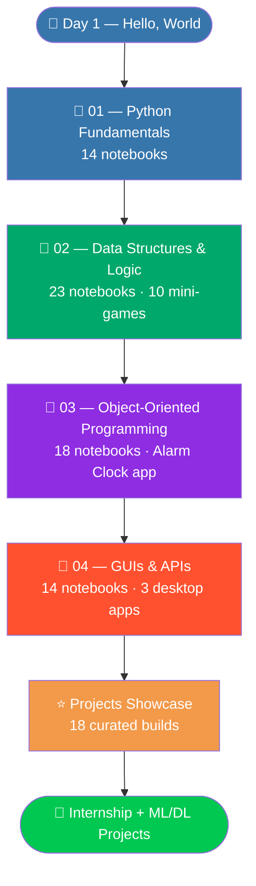

<div align="center">


<br/>

[](https://python.org)
[](https://jupyter.org)
[](https://pypi.org/project/PyQt5/)
[](https://www.youtube.com/@BroCodez)

[](https://github.com/MuhammadZafran33/Algorithm-Arsenal/stargazers)
[](https://github.com/MuhammadZafran33/Algorithm-Arsenal/commits/main)
[](https://github.com/MuhammadZafran33)

</div>

---

## 📖 Table of Contents

- [About This Course](#-about-this-course)
- [Course-Wide Stats](#-course-wide-stats)
- [Module Breakdown](#-module-breakdown)
- [Lines of Code by Module](#-lines-of-code-by-module)
- [The Full Journey](#-the-full-journey)
- [Course Roadmap](#️-course-roadmap)
- [Module Index](#-module-index)
- [Highlight Reel](#-highlight-reel)
- [Tech Stack Touched](#️-tech-stack-touched)
- [Quick Start](#-quick-start)
- [What's Next](#-whats-next-in-the-arsenal)
- [Connect](#-connect-with-me)

---

## 🐍 About This Course

**`Python By Bro Code`** is the full Python track inside my [**Algorithm Arsenal**](https://github.com/MuhammadZafran33/Algorithm-Arsenal) repository — every notebook, every mini-game, and every desktop app built by hand while working through the **Bro Code Python Full Course**.

No copy-pasting. Every one of the **69 notebooks** below was typed, run, and debugged personally — four modules that go from a first `print()` statement to a live-data desktop application, plus a dedicated folder pulling out the 18 best builds into their own showcase.

---

## 📊 Course-Wide Stats

<table>
<tr>
<td align="center"><b>📓 Notebooks</b><br/>69</td>
<td align="center"><b>🧩 Modules</b><br/>4</td>
<td align="center"><b>⭐ Star Projects</b><br/>18</td>
<td align="center"><b>🖥️ Desktop Apps</b><br/>4</td>
</tr>
<tr>
<td align="center"><b>✍️ Lines of Code</b><br/>3,789</td>
<td align="center"><b>🌐 Live APIs Used</b><br/>2 (PokeAPI, Open-Meteo)</td>
<td align="center"><b>📦 External Deps</b><br/>PyQt5, requests, pygame</td>
<td align="center"><b>🎯 Copy-Paste Used</b><br/>0</td>
</tr>
</table>

---

## 📊 Module Breakdown



---

## 📈 Lines of Code by Module



> GUIs & APIs runs the longest despite having the fewest notebooks (14) — PyQt5 layouts and the three desktop apps simply take more code than a syntax notebook does.

---

## 🧭 The Full Journey



---

## 🗺️ Course Roadmap



---

## 📚 Module Index

| # | 📁 Module | 📓 Notebooks | ✍️ Lines | 🎯 Core Topics |
|---|---|---|---|---|
| 01 | [**Python Fundamentals**](<01-Python-Fundamentals>) | 14 | 417 | `print`, variables, casting, arithmetic, conditionals, loops, string formatting + 4 mini-projects |
| 02 | [**Data Structures & Logic**](<02-Data-Structures-and-Logic>) | 23 | 892 | Lists/Dicts/Tuples/Sets, functions, `*args`/`**kwargs`, comprehensions, `match`/`case`, modules, scope — plus 10 built-in mini-games |
| 03 | [**Object-Oriented Programming**](<03-Object-Oriented-Programming>) | 18 | 790 | Classes, inheritance, polymorphism, decorators, magic methods, file I/O — plus an Alarm Clock app |
| 04 | [**GUIs & APIs**](<04-GUI-and-APIs>) | 14 | 1,690 | Multithreading, REST APIs, full PyQt5 widget set — plus 3 desktop apps |
| ⭐ | [**Projects Showcase**](<Projects>) | 18 | — | The 18 best builds from all four modules, each in its own folder |

*(Click any module name above — each has its own detailed README with per-notebook breakdowns, diagrams, and code snapshots.)*

---

## 🏆 Highlight Reel

The strongest single piece from each module:

<table>
<tr>
<td width="25%" valign="top">

**🔐 Encryption Program**
*Module 02*
A full substitution cipher — shuffles the entire printable character set into a key, then encrypts *and* decrypts any message.

</td>
<td width="25%" valign="top">

**⏰ Alarm Clock**
*Module 03*
`datetime` + `pygame` — validates a target time, polls the clock, and plays real audio the moment it matches.

</td>
<td width="25%" valign="top">

**☀️ Weather API App**
*Module 04*
PyQt5 + `QThread` + Open-Meteo — a live, key-free weather lookup that never freezes the interface.

</td>
<td width="25%" valign="top">

**🎰 Slot Machine**
*⭐ Projects*
Clean functions, docstrings, tiered payouts, and a proper `main()` guard — the most professionally structured script in the Arsenal.

</td>
</tr>
</table>

---

## 🛠️ Tech Stack Touched

<div align="center">


</div>

---

## ⚡ Quick Start

```bash
# 1. Clone the repository
git clone https://github.com/MuhammadZafran33/Algorithm-Arsenal.git

# 2. Navigate to the course
cd "Algorithm-Arsenal/Python By Bro Code"

# 3. Work through it module by module...
jupyter notebook "01-Python-Fundamentals/01_DayOfCode.ipynb"

# ...or jump straight to the showcase
cd Projects && jupyter notebook "12 ⭐ slot machine 🎰"

# 4. Modules 03 and 04 need a couple of extra installs
pip install PyQt5 requests pygame
```

---

## 🚀 What's Next in the Arsenal


This course is the foundation layer of the wider [**Algorithm Arsenal**](https://github.com/MuhammadZafran33/Algorithm-Arsenal) — every pattern here (functions, classes, threading, live APIs, responsive interfaces) carries straight over into what's coming next: **internship deliverables** and **Machine Learning / Deep Learning projects**.

---

## 🤝 Connect with Me

<div align="center">

[](https://github.com/MuhammadZafran33)
[](https://www.fiverr.com/muh_zafran)

<br/>

**Muhammad Zafran** — BS Artificial Intelligence
Institute of Management Sciences (IM|Sciences), Peshawar, Pakistan 🇵🇰

<br/>


<br/><br/>

⭐ **Star [Algorithm Arsenal](https://github.com/MuhammadZafran33/Algorithm-Arsenal)** if this helped you on your own Python journey!


</div>
